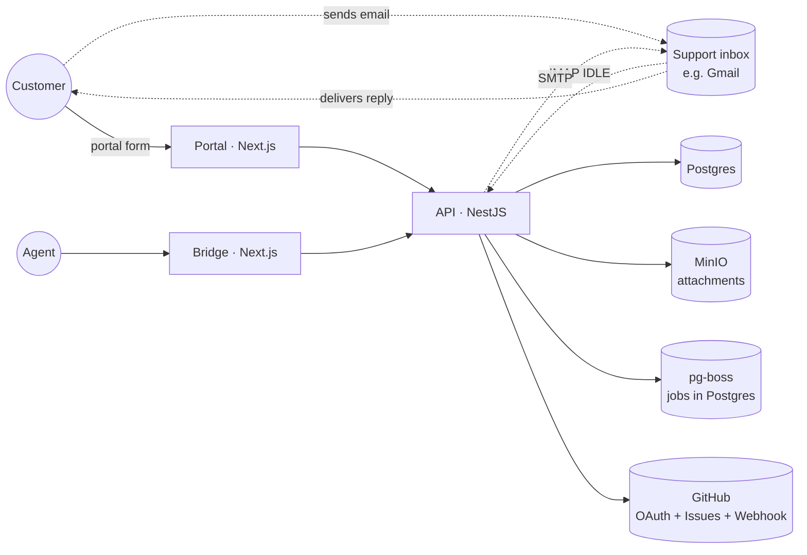

# Athena Architecture Atlas

> Living reference for how the app is wired today.
> Pair with `STATE.md` (which tracks *what changed when*).
> Update the relevant feature file in the same PR that ships a material change. See [CLAUDE.md](../../CLAUDE.md) for the rule.

## System

## Features

| Feature | Status | Stack pillars |
|---|---|---|
| [Email](email.md) | ✅ Working | imapflow · nodemailer · mailparser · pg-boss · AES-256-GCM |
| [Tickets](tickets.md) | ✅ Working | NestJS · Prisma · Postgres |
| [Messages](messages.md) | ✅ Working | NestJS · Prisma · email send-out |
| [GitHub](github.md) | ✅ Working | Octokit · HMAC-SHA256 · webhook |
| [Notifications](notifications.md) | ✅ Working (stub doc) | NestJS · 30s polling |
| [Analytics](analytics.md) | ✅ Working | Prisma `groupBy` · Recharts · two sub-pages (ops + customer insights) |
| [AI](ai.md) | ✅ Working | Gemini 2.0 Flash · pg-boss workers · AiUsage cost tracking |
| [Files](files.md) | ✅ Working (stub doc) | MinIO · presigned URLs |
| [Settings](settings.md) | ✅ Working (stub doc) | NestJS · AppConfig singleton |
| [Auth](auth.md) | ✅ Working (stub doc) | Custom JWT (HMAC-SHA256) · `localStorage` |
| [Queue](queue.md) | ✅ Working (stub doc) | pg-boss v9 · Postgres `pgboss` schema |

## Auto-generated reference

These are regenerated by `pnpm atlas:gen` — never edit by hand.

- [API routes](_generated/api-routes.md) — every Nest controller endpoint, grouped by controller
- [Database ERD](_generated/erd.md) — Mermaid `erDiagram` from `schema.prisma`, plus enum cheatsheet
- [Module graph](_generated/module-graph.md) — `flowchart` of NestJS module imports

## How to use this atlas

- **"Where does feature X live?"** → its `<feature>.md`, "Key files" section.
- **"What endpoints exist?"** → [_generated/api-routes.md](_generated/api-routes.md).
- **"What's the schema?"** → [_generated/erd.md](_generated/erd.md).
- **"How does inbound email actually work?"** → [email.md](email.md), "Inbound flow" section.
- **"When was X changed?"** → still [STATE.md](../../STATE.md). This atlas describes *now*, not *history*.

## Top-level apps & packages

| Path | What |
|---|---|
| [`apps/api`](../../apps/api) | NestJS API (port 3001), Prisma client wrapper, IMAP supervisor, queue worker |
| [`apps/portal`](../../apps/portal) | Customer-facing Next.js app (port 3000, light theme) |
| [`apps/bridge`](../../apps/bridge) | Agent-facing Next.js app (port 3002, dark theme) |
| [`packages/db`](../../packages/db) | Prisma schema, seed, Chatwoot importer |
| [`packages/types`](../../packages/types) | Shared TS types + Zod schemas |
| [`packages/ui`](../../packages/ui) | shadcn/ui scaffold for both Next apps |
| [`packages/email`](../../packages/email) | React Email templates (not yet wired to outbound) |
| [`scripts/atlas-gen.ts`](../../scripts/atlas-gen.ts) | This atlas's auto-generator |
