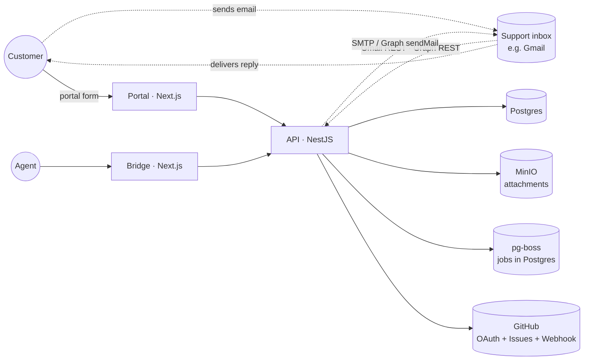

# Athena Architecture Atlas

> Living reference for how the app is wired today.
> Pair with `STATE.md` (which tracks *what changed when*).
> Update the relevant feature file in the same PR that ships a material change. See [CLAUDE.md](../../CLAUDE.md) for the rule.
>
> **Start here:** [architecture.md](architecture.md) for the system overview (services, flows, modules).

## System

## Features

| Feature | Status | Stack pillars |
|---|---|---|
| [Email](email.md) | ✅ Working | Gmail REST (history.list) · Microsoft Graph (delta) · nodemailer · NestJS Schedule · SSE · AES-256-GCM |
| [Tickets](tickets.md) | ✅ Working | NestJS · Prisma · Postgres |
| [Messages](messages.md) | ✅ Working | NestJS · Prisma · email send-out |
| [GitHub](github.md) | ✅ Working | Octokit · HMAC-SHA256 · webhook |
| [Notifications](notifications.md) | ✅ Working (stub doc) | NestJS · 30s polling |
| [Analytics](analytics.md) | ✅ Working | Prisma `groupBy` · Recharts · two sub-pages (ops + customer insights) |
| [AI](ai.md) | ✅ Working | Gemini 2.0 Flash · pg-boss workers · AiUsage cost tracking |
| [Files](files.md) | ✅ Working (stub doc) | MinIO · presigned URLs |
| [Settings](settings.md) | ✅ Working (stub doc) | NestJS · AppConfig singleton |
| [Auth](auth.md) | ✅ Working (stub doc) | Custom JWT (HMAC-SHA256) · `localStorage` |
| [Queue](queue.md) | ✅ Working (stub doc) | pg-boss v9 · Postgres `pgboss` schema |
| [Bot (Athena)](bot.md) | ✅ Working | Gemini 2.0 Flash · text-embedding-004 · pgvector HNSW · pg_trgm · RRF · Contextual Retrieval · shift routing |

## Quick Navigation

Find any feature fast: atlas doc → API module(s) → frontend page(s) → tests.

| Feature | Atlas doc | API module(s) | Frontend page(s) | Test(s) |
|---|---|---|---|---|
| Ticket lifecycle | [ticket-lifecycle.md](ticket-lifecycle.md) | `tickets`, `messages`, `email-sync`, `email`, `bot` | both apps | `integration/email-ticket-flow.spec.ts` |
| Tickets | [tickets.md](tickets.md), [portal-ticket-view.md](portal-ticket-view.md) | `tickets`, `messages` | bridge `tickets/[id]`, `inbox/`, `tickets/domain/[domain]`; portal `tickets/[id]`, `tickets/` | `integration/tickets.create.spec.ts`, `integration/email-ticket-flow.spec.ts`, `unit/api/generate-ref.spec.ts` |
| Messages | [messages.md](messages.md) | `messages` | inline in `tickets/[id]` (both apps) | `integration/tickets.create.spec.ts` |
| Email | [email.md](email.md) | `email`, `email-oauth`, `email-sync` | bridge `settings/email` | `integration/email-ticket-flow.spec.ts`, `unit/api/strip-subject.spec.ts` |
| Bot (Athena) | [bot.md](bot.md) | `bot`, `knowledge-base`, `shifts` | bridge `settings/ai-assistant`, `settings/shifts` | `integration/bot.respond.spec.ts`, `integration/shift-routing.spec.ts`, `integration/kb-fts-tsv.spec.ts`, `unit/api/rrf-fusion.spec.ts`, `unit/api/shift-resolver.spec.ts`, `unit/api/chunker.spec.ts` |
| AI analysis | [ai.md](ai.md) | `ai`, `queue` | bridge `settings/ai-assistant`, `settings/ai-usage` | `integration/ai-usage.per-user.spec.ts` |
| Analytics | [analytics.md](analytics.md) | `analytics` | bridge `analytics/operations`, `analytics/customers` | — (none yet) |
| GitHub | [github.md](github.md) | `github` | bridge `settings/github`, `github/` | — (none yet) |
| Auth | [auth.md](auth.md) | `auth`, `config` | bridge `auth/`; portal `auth/`, `auth/google/callback` | — (none yet) |
| Notifications | [notifications.md](notifications.md) | `notifications` | bridge sidebar bell, `github/` | — (none yet) |
| Settings | [settings.md](settings.md) | `config` | bridge `settings/*` | — (none yet) |
| Files | [files.md](files.md) | `files` | portal `submit/`; attachments in `tickets/[id]` | — (none yet) |
| Queue | [queue.md](queue.md) | `queue` | — (no UI) | — (none yet) |
| Real-time (SSE) | [realtime.md](realtime.md) | `events` | bridge `layout.tsx` (global SSE provider) | `contract/sse-coverage.spec.ts` |
| Customers | (in [tickets.md](tickets.md)) | `users` | bridge `customers/` | `integration/users.customers.spec.ts` |
| Health | — | `health` | — | `integration/health.spec.ts` |

## Auto-generated reference

These are regenerated by `pnpm atlas:gen` — never edit by hand.

- [API routes](_generated/api-routes.md) — every Nest controller endpoint, grouped by controller
- [Database ERD](_generated/erd.md) — Mermaid `erDiagram` from `schema.prisma`, plus enum cheatsheet
- [Module graph](_generated/module-graph.md) — `flowchart` of NestJS module imports

## How to use this atlas

- **"Where does feature X live?"** → its `<feature>.md`, "Key files" section.
- **"What endpoints exist?"** → [_generated/api-routes.md](_generated/api-routes.md).
- **"What's the schema?"** → [_generated/erd.md](_generated/erd.md).
- **"How does inbound email actually work?"** → [email.md](email.md), "Inbound flow" section.
- **"When was X changed?"** → still [STATE.md](../../STATE.md). This atlas describes *now*, not *history*.

## Top-level apps & packages

| Path | What |
|---|---|
| [`apps/api`](../../apps/api) | NestJS API (port 3001), Prisma client wrapper, email-sync poller, pg-boss AI workers |
| [`apps/portal`](../../apps/portal) | Customer-facing Next.js app (port 3000, light theme) |
| [`apps/bridge`](../../apps/bridge) | Agent-facing Next.js app (port 3002, dark theme) |
| [`packages/db`](../../packages/db) | Prisma schema, seed, Chatwoot importer |
| [`packages/types`](../../packages/types) | Shared TS types + Zod schemas |
| [`packages/ui`](../../packages/ui) | shadcn/ui scaffold for both Next apps |
| [`packages/email`](../../packages/email) | React Email templates (not yet wired to outbound) |
| [`scripts/atlas-gen.ts`](../../scripts/atlas-gen.ts) | This atlas's auto-generator |
