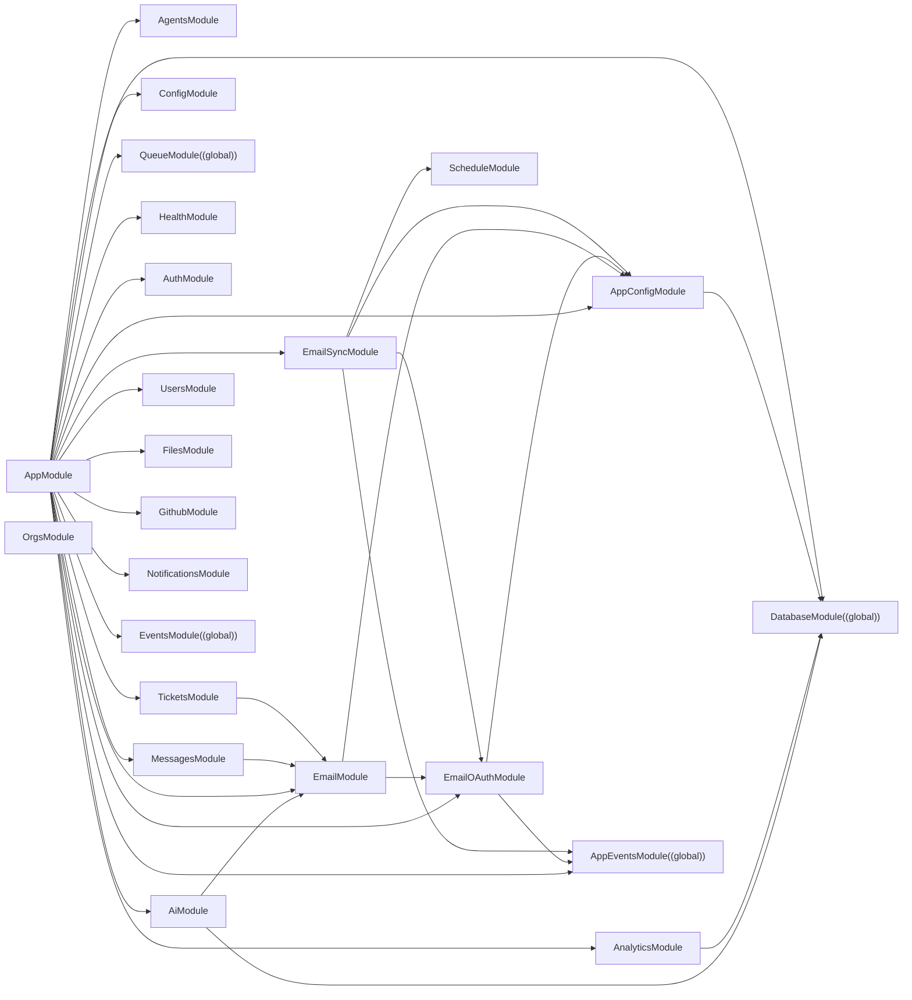

<!-- AUTO-GENERATED by scripts/atlas-gen.ts — DO NOT EDIT BY HAND -->
<!-- Run `pnpm atlas:gen` to refresh -->
_Last generated: 2026-05-27T11:27:46.659Z_

# Module graph

NestJS module imports across `apps/api`. Edges go from the module declaring an `imports: [...]` entry to the module being imported.

## Modules

| Module | Global | Imports | Providers | Exports |
|---|---|---|---|---|
| `AgentsModule` |  | — | 1 | 1 |
| `AiModule` | ✓ | DatabaseModule, EmailModule | 4 | 1 |
| `AnalyticsModule` |  | DatabaseModule | 2 | 0 |
| `AppConfigModule` |  | DatabaseModule | 1 | 1 |
| `AppEventsModule` | ✓ | — | 1 | 1 |
| `AppModule` |  | ConfigModule, AppEventsModule, DatabaseModule, QueueModule, HealthModule, AuthModule, AppConfigModule, TicketsModule, MessagesModule, AgentsModule, UsersModule, FilesModule, EmailModule, EmailOAuthModule, GithubModule, NotificationsModule, AnalyticsModule, AiModule, EmailSyncModule, EventsModule | 0 | 0 |
| `AuthModule` |  | — | 1 | 1 |
| `DatabaseModule` | ✓ | — | 1 | 1 |
| `EmailModule` |  | AppConfigModule, EmailOAuthModule | 1 | 1 |
| `EmailOAuthModule` |  | AppConfigModule, AppEventsModule | 2 | 2 |
| `EmailSyncModule` |  | AppConfigModule, EmailOAuthModule, AppEventsModule, ScheduleModule | 5 | 5 |
| `EventsModule` | ✓ | — | 1 | 1 |
| `FilesModule` |  | — | 1 | 1 |
| `GithubModule` |  | — | 1 | 1 |
| `HealthModule` |  | — | 0 | 0 |
| `MessagesModule` |  | EmailModule | 1 | 1 |
| `NotificationsModule` |  | — | 1 | 1 |
| `OrgsModule` |  | — | 1 | 1 |
| `QueueModule` | ✓ | — | 1 | 1 |
| `TicketsModule` |  | EmailModule | 1 | 1 |
| `UsersModule` |  | — | 1 | 1 |

_Total: **21 modules** (5 global)._
