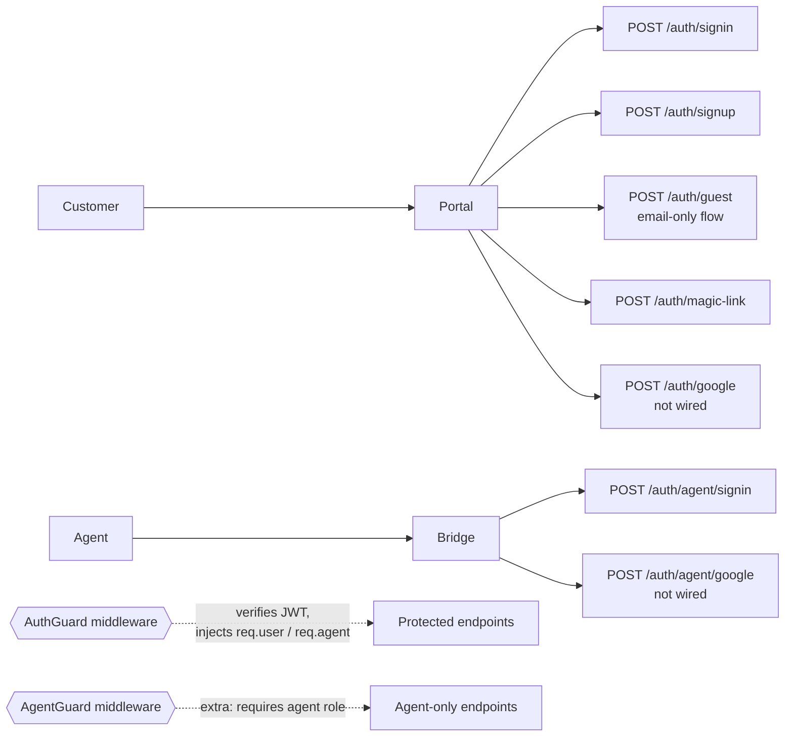

# Auth

## What it does

Two parallel identity systems:

| Identity | Used by | Storage |
|---|---|---|
| `User` | Customers (portal, inbound email) | `User` table |
| `Agent` | Support team (Bridge) | `Agent` table |

Authentication is **custom JWT** (HMAC-SHA256, signed with `BETTER_AUTH_SECRET`). Tokens are kept in `localStorage` on both front-ends. The same JWT format is used for users and agents — the payload distinguishes via `role`.

## Sign-in paths

## Guards & decorators

| File | Purpose |
|---|---|
| [`apps/api/src/common/guards/auth.guard.ts`](../../apps/api/src/common/guards/auth.guard.ts) | Verifies the JWT, loads the User or Agent, attaches to request |
| [`apps/api/src/common/guards/agent.guard.ts`](../../apps/api/src/common/guards/agent.guard.ts) | Requires the caller to be an Agent (rejects pure user JWTs) |
| [`apps/api/src/common/decorators/current-user.decorator.ts`](../../apps/api/src/common/decorators/current-user.decorator.ts) | `@CurrentUser()` injection |
| [`apps/api/src/common/decorators/current-agent.decorator.ts`](../../apps/api/src/common/decorators/current-agent.decorator.ts) | `@CurrentAgent()` injection |

## Key files

| File | Role |
|---|---|
| [`apps/api/src/modules/auth/auth.controller.ts`](../../apps/api/src/modules/auth/auth.controller.ts) | All `/auth/*` endpoints |
| [`apps/api/src/modules/auth/auth.service.ts`](../../apps/api/src/modules/auth/auth.service.ts) | JWT sign + verify, password hashing, magic-link generation, guest session |
| [`apps/portal/src/lib/auth.tsx`](../../apps/portal/src/lib/auth.tsx) | Customer auth context (localStorage JWT) |
| [`apps/bridge/src/lib/auth.tsx`](../../apps/bridge/src/lib/auth.tsx) | Agent auth context |

## Endpoints

See `AuthController` in [_generated/api-routes.md](_generated/api-routes.md#authcontroller).

## Environment variables

| Var | Purpose |
|---|---|
| `BETTER_AUTH_SECRET` | HMAC key for JWT signing (~32 random bytes) |
| `GOOGLE_CLIENT_ID` / `GOOGLE_CLIENT_SECRET` | OAuth credentials (button renders but flow isn't wired end-to-end yet) |

## Notable decisions

- **Custom JWT** instead of `better-auth`. Better Auth's schema conflicted with our custom Prisma models. We implemented HMAC-SHA256 sign + verify in ~40 lines.
- **`localStorage` JWT** is acceptable for internal-tool scale; production deployments should consider `httpOnly` cookies.
- **Guest flow**: portal `Submit` POSTs to `/auth/guest` first with the customer's email; gets back a short-lived token sufficient to upload files and create a ticket. The User row is real, just `isGuest = true` until they sign up.

## Known gaps

- **Google OAuth not wired**. The button on both Portal and Bridge renders, but no working Google Cloud project is configured.
- **Forgot password / magic-link UI**. The API endpoint exists; the portal doesn't have a flow that uses it yet.
- **Token rotation / refresh tokens** — JWTs are long-lived; no rotation strategy.
