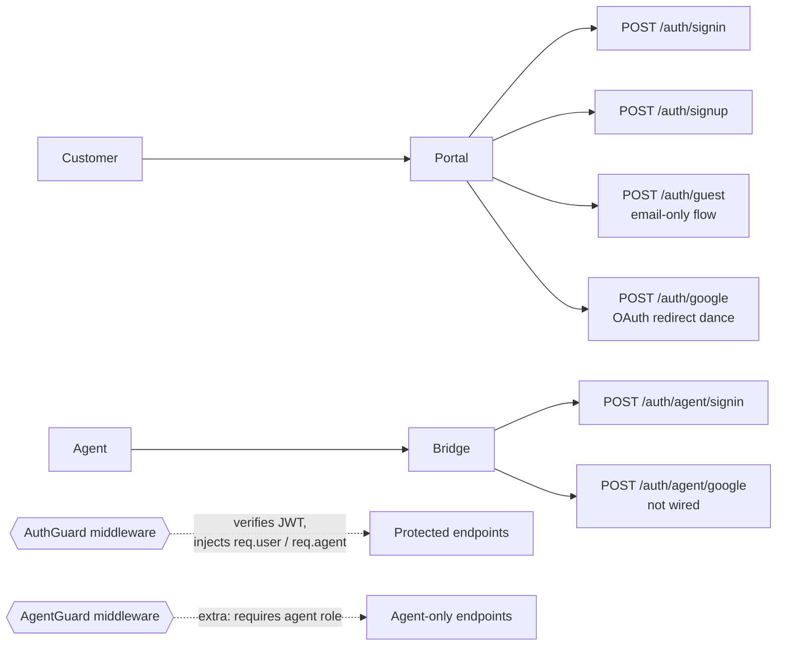
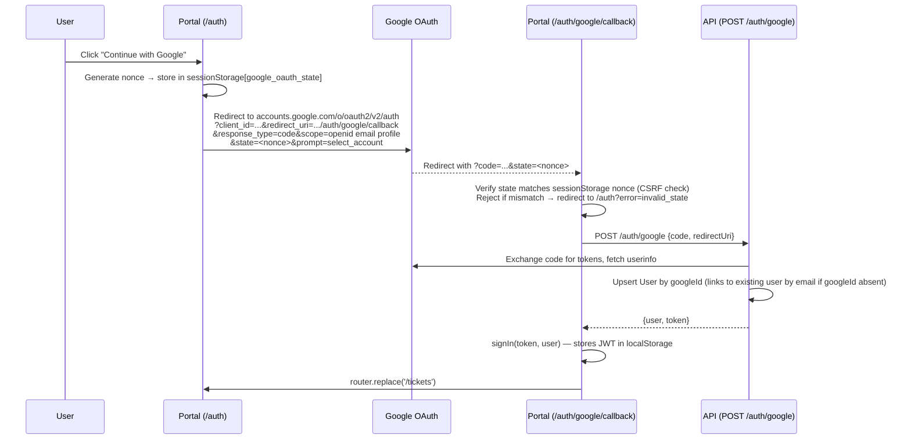

# Auth

## What it does

Two parallel identity systems:

| Identity | Used by | Storage |
|---|---|---|
| `User` | Customers (portal, inbound email) | `User` table |
| `Agent` | Support team (Bridge) | `Agent` table |

Authentication is **custom JWT** (HMAC-SHA256, signed with `BETTER_AUTH_SECRET`). Tokens are kept in `localStorage` on both front-ends. The same JWT format is used for users and agents — the payload distinguishes via `role`.

## Sign-in paths



## Guards & decorators

| File | Purpose |
|---|---|
| [`apps/api/src/common/guards/auth.guard.ts`](../../apps/api/src/common/guards/auth.guard.ts) | Verifies the JWT, loads the User or Agent, attaches to request |
| [`apps/api/src/common/guards/agent.guard.ts`](../../apps/api/src/common/guards/agent.guard.ts) | Requires the caller to be an Agent (rejects pure user JWTs) |
| [`apps/api/src/common/decorators/current-user.decorator.ts`](../../apps/api/src/common/decorators/current-user.decorator.ts) | `@CurrentUser()` injection |
| [`apps/api/src/common/decorators/current-agent.decorator.ts`](../../apps/api/src/common/decorators/current-agent.decorator.ts) | `@CurrentAgent()` injection |

## Key files

| File | Role |
|---|---|
| [`apps/api/src/modules/auth/auth.controller.ts`](../../apps/api/src/modules/auth/auth.controller.ts) | All `/auth/*` endpoints |
| [`apps/api/src/modules/auth/auth.service.ts`](../../apps/api/src/modules/auth/auth.service.ts) | JWT sign + verify, password hashing, guest session |
| [`apps/portal/src/lib/auth.tsx`](../../apps/portal/src/lib/auth.tsx) | Customer auth context (localStorage JWT) |
| [`apps/bridge/src/lib/auth.tsx`](../../apps/bridge/src/lib/auth.tsx) | Agent auth context |

## Endpoints

See `AuthController` in [_generated/api-routes.md](_generated/api-routes.md#authcontroller).

## Environment variables

| Var | Purpose |
|---|---|
| `BETTER_AUTH_SECRET` | HMAC key for JWT signing (~32 random bytes) |
| `GOOGLE_CLIENT_ID` / `GOOGLE_CLIENT_SECRET` | OAuth credentials (button renders but flow isn't wired end-to-end yet) |

## Portal Google OAuth flow

The "Continue with Google" button on the portal auth page performs a full OAuth redirect dance. The backend `POST /auth/google` endpoint already existed; this section describes the portal-side wiring.

### Sequence



### Error handling

| Failure | Behavior |
|---|---|
| User denies consent | Google redirects with `?error=access_denied` → callback redirects to `/auth?error=google_cancelled` |
| State mismatch (CSRF) | `verifyAndConsumeState()` returns false → redirect to `/auth?error=invalid_state` |
| Code exchange fails (server-side) | API throws `500` with Google's `error_description` (e.g. `invalid_client` if `GOOGLE_CLIENT_SECRET` is missing) |
| Code exchange fails (4xx from API) | Callback shows inline error message with "Back to sign in" link |
| No `NEXT_PUBLIC_GOOGLE_CLIENT_ID` env var | `redirectToGoogle()` logs error and aborts silently |
| 15 s timeout | Callback shows "Sign-in timed out" error |

### Key files

| File | Role |
|---|---|
| [`apps/portal/src/lib/googleOAuth.ts`](../../apps/portal/src/lib/googleOAuth.ts) | `redirectToGoogle()` — builds consent URL, stores nonce; `verifyAndConsumeState()` — CSRF check on callback |
| [`apps/portal/src/app/auth/google/callback/page.tsx`](../../apps/portal/src/app/auth/google/callback/page.tsx) | Callback page — verifies state, POSTs code to API, calls `signIn`, redirects |
| [`apps/portal/src/components/auth/AuthForm.tsx`](../../apps/portal/src/components/auth/AuthForm.tsx) | Both Google buttons (sign-in + sign-up tabs) call `redirectToGoogle()` |
| [`apps/api/src/modules/auth/auth.controller.ts`](../../apps/api/src/modules/auth/auth.controller.ts) | `POST /auth/google` — server-side code exchange + user upsert |

### Google Cloud Console setup (manual — operator action required)

The portal uses the same Google OAuth client as the agent auth flow (`GOOGLE_CLIENT_ID` / `GOOGLE_CLIENT_SECRET`). The only setup step is to add the portal callback URI to the client's **Authorized redirect URIs**:

```
<portal-origin>/auth/google/callback
```

Example for local dev: `http://localhost:3000/auth/google/callback`

Do NOT use the `GOOGLE_OAUTH_CLIENT_ID` (that's the Gmail REST OAuth client). Use `GOOGLE_CLIENT_ID`.

### Environment variables

| Var | Where | Purpose |
|---|---|---|
| `NEXT_PUBLIC_GOOGLE_CLIENT_ID` | Portal | Public client ID for constructing the consent URL |
| `GOOGLE_CLIENT_ID` / `GOOGLE_CLIENT_SECRET` | API | Server-side code exchange |

## Notable decisions

- **Custom JWT** instead of `better-auth`. Better Auth's schema conflicted with our custom Prisma models. We implemented HMAC-SHA256 sign + verify in ~40 lines.
- **`localStorage` JWT** is acceptable for internal-tool scale; production deployments should consider `httpOnly` cookies.
- **Guest flow**: portal `Submit` POSTs to `/auth/guest` first with the customer's email; gets back a short-lived token sufficient to upload files and create a ticket. If the email belongs to an existing real account the same endpoint succeeds — a guest token is issued bound to that user's ID, but `user.isGuest` is NOT changed. `NoGuestsGuard` (decorator `@NoGuests()`) is applied to list endpoints (e.g. `GET /tickets`) so a guest token bound to a real account cannot browse account history.
- **State nonce in `sessionStorage`** (not `localStorage`): nonce survives the redirect round-trip (same tab) but not cross-tab access, which is the correct scope for CSRF protection.
- **`handledRef` prevents Strict Mode double-invoke**: React 18 Strict Mode mounts → unmounts → remounts effects. Without the ref, the second mount finds an empty sessionStorage (nonce was consumed on first mount) and incorrectly redirects to `/auth?error=invalid_state`. `handledRef.current = true` after first execution guards against this. Same pattern used in Bridge's GitHub OAuth callback.
- **Same Google OAuth client for portal + agent**: avoids creating a second Google Cloud client. The only difference is that the portal callback URI must be added to the existing client's authorized list.
- **Server-side token exchange validates `access_token` presence**: `auth.service.ts` now throws `InternalServerErrorException` with Google's error description if the token exchange response has no `access_token`. Previously a missing secret caused a silent cascade to `googleId: undefined` → Prisma crash.

## Known gaps

- **Agent Google OAuth not wired**. Bridge's `POST /auth/agent/google` exists but the Bridge UI button has no click handler.
- **No forgot-password flow**. The former `POST /auth/magic-link` endpoint was removed from the API; there is currently no password-reset path at all (neither API nor portal UI).
- **Token rotation / refresh tokens** — JWTs are long-lived; no rotation strategy.
