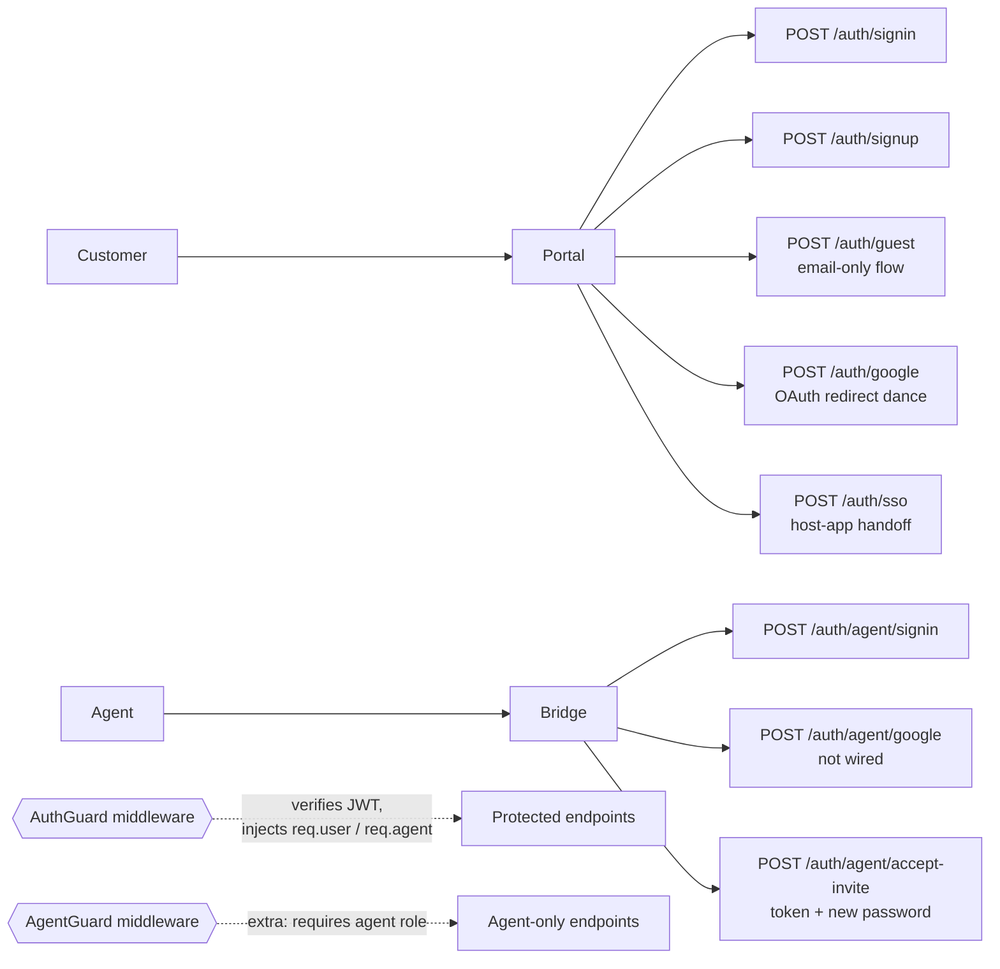
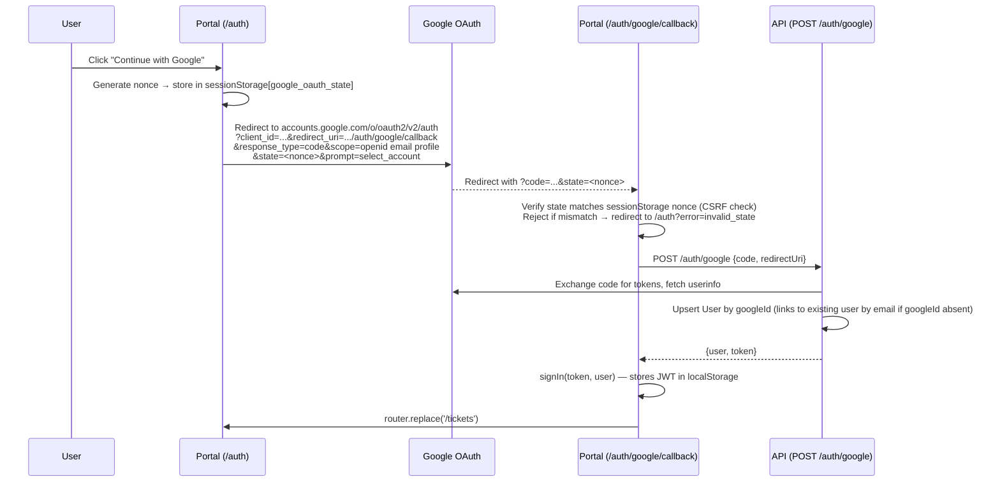
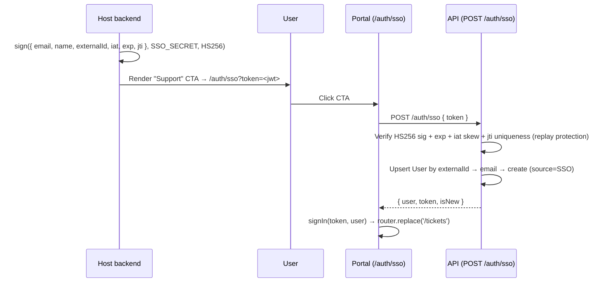

# Auth

## What it does

Two parallel identity systems:

| Identity | Used by | Storage |
|---|---|---|
| `User` | Customers (portal, inbound email) | `User` table |
| `Agent` | Support team (Bridge) | `Agent` table |

Authentication is **custom JWT** (HMAC-SHA256, signed with `BETTER_AUTH_SECRET`). Tokens are kept in `localStorage` on both front-ends. The same JWT format is used for users and agents — the payload distinguishes via `role`.

## Sign-in paths



## Guards & decorators

| File | Purpose |
|---|---|
| [`apps/api/src/common/guards/auth.guard.ts`](../../apps/api/src/common/guards/auth.guard.ts) | Verifies the JWT, loads the User or Agent, attaches to request |
| [`apps/api/src/common/guards/agent.guard.ts`](../../apps/api/src/common/guards/agent.guard.ts) | Requires the caller to be an Agent (rejects pure user JWTs) |
| [`apps/api/src/common/decorators/current-user.decorator.ts`](../../apps/api/src/common/decorators/current-user.decorator.ts) | `@CurrentUser()` injection |
| [`apps/api/src/common/decorators/current-agent.decorator.ts`](../../apps/api/src/common/decorators/current-agent.decorator.ts) | `@CurrentAgent()` injection |

## Key files

| File | Role |
|---|---|
| [`apps/api/src/modules/auth/auth.controller.ts`](../../apps/api/src/modules/auth/auth.controller.ts) | All `/auth/*` endpoints |
| [`apps/api/src/modules/auth/auth.service.ts`](../../apps/api/src/modules/auth/auth.service.ts) | JWT sign + verify, password hashing, guest session, magic tokens |
| [`apps/portal/src/lib/auth.tsx`](../../apps/portal/src/lib/auth.tsx) | Customer auth context (localStorage JWT) |
| [`apps/bridge/src/lib/auth.tsx`](../../apps/bridge/src/lib/auth.tsx) | Agent auth context |

## Endpoints

See `AuthController` in [_generated/api-routes.md](_generated/api-routes.md#authcontroller).

## Email verification (soft gate)

On `POST /auth/signup`, the API creates a single-use `MagicToken` (`type: EMAIL_VERIFICATION`,
24h TTL) and enqueues an `email:send-verification` job. The user is **signed in immediately** —
verification is a soft gate, not a blocker. While `User.isVerified === false`, the portal shows a
persistent `VerificationBanner` (in `PortalNav`, above every page) with a "Resend" button
(`POST /auth/resend-verification`, authenticated).

`POST /auth/verify-email { token }` consumes the token and sets `User.isVerified = true`.
Google OAuth signups/links (`googleAuth()`) set `isVerified: true` immediately — Google has
already verified the email address.

```mermaid
flowchart LR
  Signup[POST /auth/signup] -->|creates MagicToken<br/>EMAIL_VERIFICATION, 24h| Enqueue[enqueueEmailVerification]
  Enqueue --> Worker[SendVerificationWorker]
  Worker -->|skips if AppConfig missing<br/>or user already verified| Email[sendEmailVerification]
  Email -->|"${PORTAL_URL}/verify-email?token=..."| Link
  Link --> Verify[POST /auth/verify-email]
  Verify -->|consumes token, sets isVerified=true| Done[Banner disappears]
```



### Key files

| File | Role |
|---|---|
| [`apps/api/src/modules/email/workers/send-verification.worker.ts`](../../apps/api/src/modules/email/workers/send-verification.worker.ts) | Sends the verification email (no suppression — always runs) |
| [`apps/portal/src/app/verify-email/page.tsx`](../../apps/portal/src/app/verify-email/page.tsx) | Consumes `?token=`, shows loading/success/error states |
| [`apps/portal/src/components/portal/VerificationBanner.tsx`](../../apps/portal/src/components/portal/VerificationBanner.tsx) | Persistent banner + resend button, hidden once `isVerified` or for guests |

## Forgot / reset password

`POST /auth/forgot-password { email }` always returns `200` (no account enumeration). For real
accounts with a password, it creates a single-use `MagicToken` (`type: PASSWORD_RESET`, 1h TTL)
and enqueues an `email:send-password-reset` job. `POST /auth/reset-password { token, password }`
consumes the token, updates the password hash, and sets `isVerified = true` (a working reset link
proves email ownership).

The portal's previously-dead "Forgot password?" button (on `/auth`) now routes to
`/forgot-password`, which always shows the same "Check your email" confirmation regardless of
whether the account exists.

### Key files

| File | Role |
|---|---|
| [`apps/api/src/modules/email/workers/send-password-reset.worker.ts`](../../apps/api/src/modules/email/workers/send-password-reset.worker.ts) | Sends the reset email (no suppression — always runs) |
| [`apps/portal/src/app/forgot-password/page.tsx`](../../apps/portal/src/app/forgot-password/page.tsx) | Email-only form, always shows "Check your email" |
| [`apps/portal/src/app/reset-password/page.tsx`](../../apps/portal/src/app/reset-password/page.tsx) | Consumes `?token=`, sets a new password |

## Environment variables

| Var | Purpose |
|---|---|
| `BETTER_AUTH_SECRET` | HMAC key for JWT signing (~32 random bytes) |
| `GOOGLE_CLIENT_ID` / `GOOGLE_CLIENT_SECRET` | OAuth credentials (button renders but flow isn't wired end-to-end yet) |

## Portal Google OAuth flow

The "Continue with Google" button on the portal auth page performs a full OAuth redirect dance. The backend `POST /auth/google` endpoint already existed; this section describes the portal-side wiring.

### Sequence



### Error handling

| Failure | Behavior |
|---|---|
| User denies consent | Google redirects with `?error=access_denied` → callback redirects to `/auth?error=google_cancelled` |
| State mismatch (CSRF) | `verifyAndConsumeState()` returns false → redirect to `/auth?error=invalid_state` |
| Code exchange fails (server-side) | API throws `500` with Google's `error_description` (e.g. `invalid_client` if `GOOGLE_CLIENT_SECRET` is missing) |
| Code exchange fails (4xx from API) | Callback shows inline error message with "Back to sign in" link |
| No `NEXT_PUBLIC_GOOGLE_CLIENT_ID` env var | `redirectToGoogle()` logs error and aborts silently |
| 15 s timeout | Callback shows "Sign-in timed out" error |

### Key files

| File | Role |
|---|---|
| [`apps/portal/src/lib/googleOAuth.ts`](../../apps/portal/src/lib/googleOAuth.ts) | `redirectToGoogle()` — builds consent URL, stores nonce; `verifyAndConsumeState()` — CSRF check on callback |
| [`apps/portal/src/app/auth/google/callback/page.tsx`](../../apps/portal/src/app/auth/google/callback/page.tsx) | Callback page — verifies state, POSTs code to API, calls `signIn`, redirects |
| [`apps/portal/src/components/auth/AuthForm.tsx`](../../apps/portal/src/components/auth/AuthForm.tsx) | Both Google buttons (sign-in + sign-up tabs) call `redirectToGoogle()` |
| [`apps/api/src/modules/auth/auth.controller.ts`](../../apps/api/src/modules/auth/auth.controller.ts) | `POST /auth/google` — server-side code exchange + user upsert |

### Google Cloud Console setup (manual — operator action required)

The portal uses the same Google OAuth client as the agent auth flow (`GOOGLE_CLIENT_ID` / `GOOGLE_CLIENT_SECRET`). The only setup step is to add the portal callback URI to the client's **Authorized redirect URIs**:

```
<portal-origin>/auth/google/callback
```

Example for local dev: `http://localhost:3000/auth/google/callback`

Do NOT use the `GOOGLE_OAUTH_CLIENT_ID` (that's the Gmail REST OAuth client). Use `GOOGLE_CLIENT_ID`.

### Environment variables

| Var | Where | Purpose |
|---|---|---|
| `NEXT_PUBLIC_GOOGLE_CLIENT_ID` | Portal | Public client ID for constructing the consent URL |
| `GOOGLE_CLIENT_ID` / `GOOGLE_CLIENT_SECRET` | API | Server-side code exchange |

## Embedded Portal SSO (host-app handoff)

Allows a host application to link its already-authenticated users directly into the portal with no second login. The host backend mints a short-lived HS256 JWT signed with a shared secret; the portal page `/auth/sso` exchanges it for a normal portal session.

### Flow



### Configuration (Bridge → Settings → Embedded Portal)

1. Enable the toggle (`ssoEnabled = true`).
2. Set the shared secret (`ssoSecretEnc` — encrypted at rest with AES-256-GCM).
3. Use the Node.js integration snippet in the settings page to mint tokens server-side.

### Security invariants

- Token must use `alg: HS256`. RS256 is not supported in v1.
- `exp` must be ≤ 120 s from `iat` (enforced at mint time by convention; API enforces expiry).
- `jti` is required and consumed on first exchange (`SsoUsedToken` table) — each token is single-use.
- The shared secret is **never** returned by `GET /config` (only `ssoSecretSet: boolean` is exposed).
- Tokens must be minted server-side only. Never expose the secret to the browser.

### Key files

| File | Role |
|---|---|
| [`apps/api/src/modules/auth/auth.service.ts`](../../apps/api/src/modules/auth/auth.service.ts) | `ssoAuth()` + `verifyExternalJwt()` |
| [`apps/api/src/modules/auth/auth.controller.ts`](../../apps/api/src/modules/auth/auth.controller.ts) | `POST /auth/sso` |
| [`apps/portal/src/app/auth/sso/page.tsx`](../../apps/portal/src/app/auth/sso/page.tsx) | Handoff page — POSTs token, calls `signIn`, redirects |
| [`apps/bridge/src/app/settings/sso/page.tsx`](../../apps/bridge/src/app/settings/sso/page.tsx) | Settings UI — toggle, secret field, integration snippet |
| [`packages/db/prisma/schema.prisma`](../../packages/db/prisma/schema.prisma) | `SsoUsedToken` model, `User.externalId`, `AppConfig.ssoEnabled/ssoSecretEnc`, `UserSource.SSO` |

### Environment variables

| Var | Purpose |
|---|---|
| `EMAIL_CREDS_KEY` | AES-256-GCM key used to encrypt `ssoSecretEnc` at rest (same key as OAuth tokens) |

## Notable decisions

- **Custom JWT** instead of `better-auth`. Better Auth's schema conflicted with our custom Prisma models. We implemented HMAC-SHA256 sign + verify in ~40 lines.
- **`localStorage` JWT** is acceptable for internal-tool scale; production deployments should consider `httpOnly` cookies.
- **Guest flow**: portal `Submit` POSTs to `/auth/guest` first with the customer's email; gets back a short-lived token sufficient to upload files and create a ticket. If the email belongs to an existing real account the same endpoint succeeds — a guest token is issued bound to that user's ID, but `user.isGuest` is NOT changed. `NoGuestsGuard` (decorator `@NoGuests()`) is applied to list endpoints (e.g. `GET /tickets`) so a guest token bound to a real account cannot browse account history.
- **State nonce in `sessionStorage`** (not `localStorage`): nonce survives the redirect round-trip (same tab) but not cross-tab access, which is the correct scope for CSRF protection.
- **`handledRef` prevents Strict Mode double-invoke**: React 18 Strict Mode mounts → unmounts → remounts effects. Without the ref, the second mount finds an empty sessionStorage (nonce was consumed on first mount) and incorrectly redirects to `/auth?error=invalid_state`. `handledRef.current = true` after first execution guards against this. Same pattern used in Bridge's GitHub OAuth callback.
- **Same Google OAuth client for portal + agent**: avoids creating a second Google Cloud client. The only difference is that the portal callback URI must be added to the existing client's authorized list.
- **Server-side token exchange validates `access_token` presence**: `auth.service.ts` now throws `InternalServerErrorException` with Google's error description if the token exchange response has no `access_token`. Previously a missing secret caused a silent cascade to `googleId: undefined` → Prisma crash.
- **Email verification is a soft gate, not a hard block**: signup signs the user in immediately and shows a dismissible-by-action (not dismissible-by-click) banner instead of blocking access. Matches the low-friction support-ticket use case — customers shouldn't be locked out of filing a ticket over an unverified email.
- **`MagicToken` reused for both verification and password reset**, distinguished by a new `type: MagicTokenType` column (`EMAIL_VERIFICATION` | `PASSWORD_RESET`) rather than adding a second token model.
- **No feature flag / `maintenanceMode` gating on these flows**: `SendVerificationWorker` and `SendPasswordResetWorker` do not call `isFeatureSuppressed` — email verification and password reset are core auth flows that must always work, even if other email features are suppressed.
- **`forgot-password` always returns 200** regardless of whether the account exists, to avoid leaking which emails have accounts (enumeration).
- **SSO uses HMAC shared secret over OIDC/SAML** — single-tenant, first-party host only. OIDC/SAML are over-engineered for this use case; HMAC mirrors Intercom's "identity verification" model. RS256 (for untrusted third-party hosts) can be added as a second mode later.
- **SSO replay protection via `SsoUsedToken` table** — a single-column keyed on `jti` (primary key). Unique-constraint violation (`P2002`) = replay → rejected. Row TTL cleanup (cron delete past `expiresAt`) is deferred to v2.
- **SSO `externalId` is a stable host user ID** — stored on `User.externalId` (unique index). Lookup order: `externalId` → `email` (backfills `externalId` on first match) → create new. Prevents duplicate accounts when the same user signs in via different paths.

## Agent invite accept flow

When an admin invites an agent (`POST /agents/invite`):
1. An `Agent` row is upserted with a random `inviteToken` and `inviteAccepted = false`.
2. `AgentsService.invite()` fires `EmailService.sendAgentInvite()` fire-and-forget with a link to `/auth/accept-invite?token=<token>` (BRIDGE_URL).
3. The agent visits the link, lands on `apps/bridge/src/app/auth/accept-invite/page.tsx`, and sets a password.
4. The page POSTs to `POST /auth/agent/accept-invite { token, password }`.
5. `AuthService.acceptAgentInvite()` looks up the agent by `inviteToken`, hashes the password, sets `inviteAccepted = true`, clears `inviteToken` (single-use), and returns `{ agent, token }` like `agentSignin`.
6. Bridge stores the JWT and redirects to `/inbox`.

## Known gaps

- **Agent Google OAuth not wired**. Bridge's `POST /auth/agent/google` exists but the Bridge UI button has no click handler.
- **Token rotation / refresh tokens** — JWTs are long-lived; no rotation strategy.
- **SSO `SsoUsedToken` cleanup** — expired rows are never deleted. A cheap periodic cron (`DELETE FROM "SsoUsedToken" WHERE "expiresAt" < now()`) should be added in v2.
- **SSO RS256 mode** — v1 only supports HS256 (shared secret). For untrusted third-party host apps, an RS256 mode where the host provides their public key would be needed.
