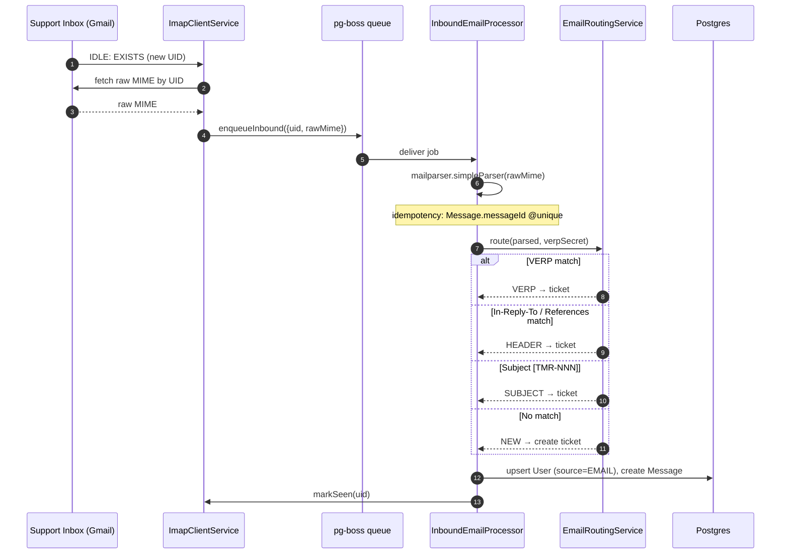
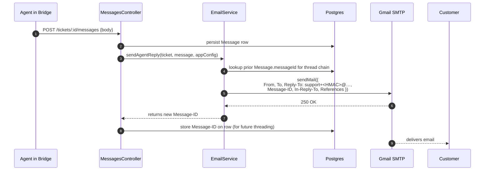
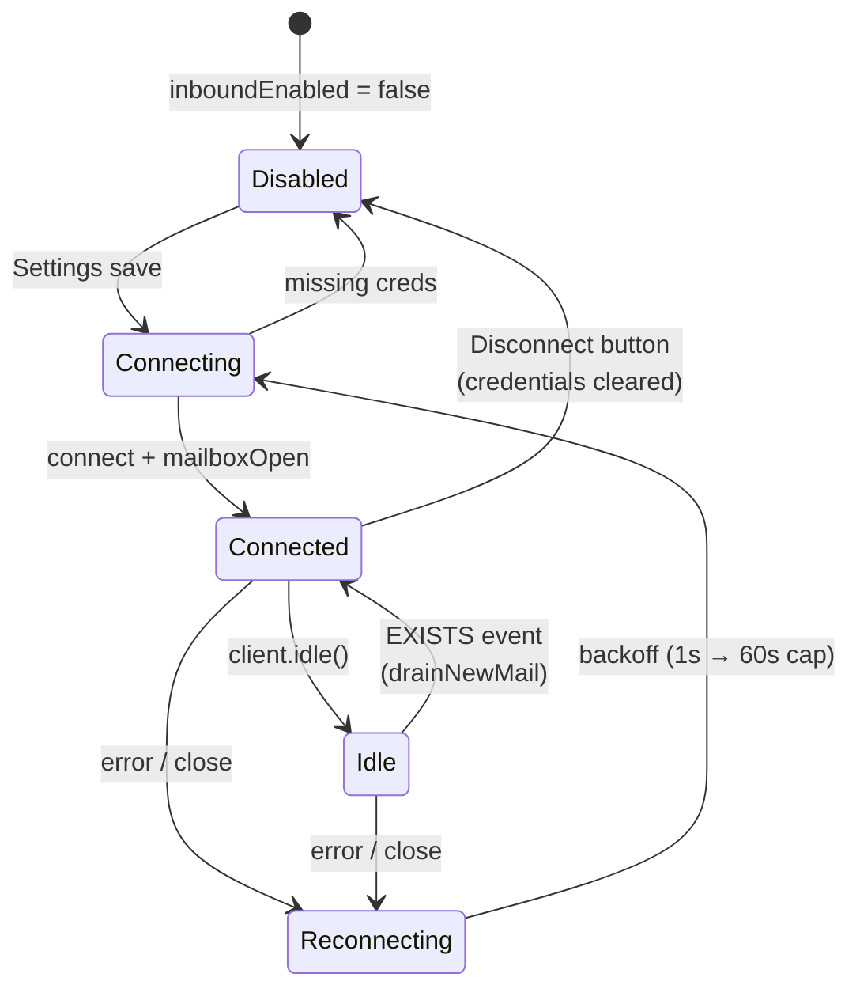

# Email

## What it does

Customers and agents have a real two-way email conversation that mirrors the ticket thread in Bridge.

- The org points the app at their existing support inbox (Gmail / Workspace / M365 / Zoho — anything that speaks IMAP). Credentials are entered once in **Settings → Email** as email + app password; host/port come from env.
- **Outbound**: when an agent replies in Bridge, the customer receives a real email from the support address, threaded into the existing Gmail conversation.
- **Inbound**: when a customer replies, the IMAP IDLE supervisor pulls the new message within ~2 seconds, routes it to the correct ticket (or creates a new one), and persists a `Message` row.

## Stack

| Layer | Library / service | Why |
|---|---|---|
| IMAP client | `imapflow` | Modern, supports persistent IDLE + auto-reconnect |
| Outbound | `nodemailer` | SMTP transport |
| Parsing | `mailparser` | Raw MIME → structured JS object |
| Queue | `pg-boss` v9 | Crash-safe retries on Postgres, no Redis |
| Credential encryption | Node `crypto` (AES-256-GCM) | App passwords stored encrypted at rest |
| Threading | RFC 5322 `Message-ID` / `In-Reply-To` / `References` | Real headers; Gmail / Outlook thread correctly |

## Inbound flow

## Outbound flow

## Routing decision (inbound)

Four strategies, in order. First hit wins; the last one always succeeds.

| Order | Strategy | What it inspects | Notes |
|---|---|---|---|
| 1 | **VERP** | `support+<emailThreadId>.<hmac>@<domain>` in To/Cc | HMAC-signed token. Gmail plus-addressing delivers back to the same mailbox. |
| 2 | **Header** | `In-Reply-To` and `References` headers | Looked up against `Message.messageId` stored on prior rows. Catches forwarded threads and clients that strip VERP. |
| 3 | **Subject tag** | `[TMR-1234]` pattern in subject line | Last resort. Useful when customers change subjects. |
| 4 | **New ticket** | None of the above matched | Creates a brand-new ticket. Sender becomes a `source: EMAIL` user. |

Plus a **loop guard** in front of routing that drops messages with `Auto-Submitted`, `Precedence: bulk|list|junk`, `X-Autoreply`, or `noreply@` / `mailer-daemon@` / `postmaster@` senders.

## Connection lifecycle

The supervisor uses a **connection token** (`connectionId`) so any handler from a superseded client silently bails — no hot loops on bad credentials, no double-supervisor on config save.

## Key files

| File | Role |
|---|---|
| [`apps/api/src/modules/email/imap-client.service.ts`](../../apps/api/src/modules/email/imap-client.service.ts) | IMAP IDLE supervisor, reconnect/backoff, mark-seen ack |
| [`apps/api/src/modules/email/inbound.processor.ts`](../../apps/api/src/modules/email/inbound.processor.ts) | pg-boss worker for `email.inbound` queue — full processing pipeline |
| [`apps/api/src/modules/email/email.service.ts`](../../apps/api/src/modules/email/email.service.ts) | Outbound (`nodemailer`), threading-header builder, VERP-signed Reply-To |
| [`apps/api/src/modules/email/routing.service.ts`](../../apps/api/src/modules/email/routing.service.ts) | Four-strategy router + loop guard |
| [`apps/api/src/modules/email/verp.util.ts`](../../apps/api/src/modules/email/verp.util.ts) | HMAC-SHA256 sign + verify for the reply token |
| [`apps/api/src/common/crypto/credentials-cipher.ts`](../../apps/api/src/common/crypto/credentials-cipher.ts) | AES-256-GCM encrypt/decrypt for IMAP + SMTP passwords |
| [`apps/api/src/modules/config/config.service.ts`](../../apps/api/src/modules/config/config.service.ts) | Test-connection endpoint, disconnect endpoint, encrypted creds writes |
| [`apps/bridge/src/app/settings/email/page.tsx`](../../apps/bridge/src/app/settings/email/page.tsx) | Settings → Email UI (email + app password only) |

## Endpoints

See `ConfigController` in [_generated/api-routes.md](_generated/api-routes.md#configcontroller) — `POST /config/email/test`, `DELETE /config/email`, and the `PATCH /config` that handles the credential save.

## Data model touched

`AppConfig` (`imapUser`, `imapPasswordEnc`, `smtpUser`, `smtpPasswordEnc`, `smtpFrom`, `verpSecret`, `inboundEnabled`, `inboundLastUid`), `Message` (`messageId`, `inReplyTo`, `bodyRaw`), `Ticket` (`source = EMAIL`), `User` (`source = EMAIL`, `isVerified = false`).

See [_generated/erd.md](_generated/erd.md) for the full ERD.

## Environment variables

| Var | Default | Purpose |
|---|---|---|
| `IMAP_HOST` | `imap.gmail.com` | IMAP server |
| `IMAP_PORT` | `993` | IMAP port (TLS) |
| `SMTP_HOST` | `smtp.gmail.com` | SMTP server |
| `SMTP_PORT` | `587` | SMTP port (STARTTLS) |
| `EMAIL_CREDS_KEY` | (required) | AES-256-GCM key for credential encryption — `openssl rand -hex 32` |

Per-deployment defaults are Gmail; non-Gmail providers (Outlook 365, Zoho, FastMail) work by overriding the env vars.

## Notable decisions

- **Plus-addressing on the support mailbox** (`support+<token>@gmail.com`), not a separate `reply@` mailbox. Gmail delivers `support+anything@gmail.com` to `support@gmail.com` automatically — we use this to receive customer replies without DNS setup.
- **IMAP cursor parks at `uidNext - 1`** on first connect. Otherwise the worker would vacuum the entire historical inbox. We hit this on day one and now have a regression guard.
- **Outbound `In-Reply-To` uses real Message-IDs** stored on prior `Message` rows — not a synthetic `<ticket-X@domain>` root. This is what makes email-originated threads also thread correctly in Gmail.
- **Idempotency lives on `Message.messageId @unique`** — we removed the dedicated `EmailInboundLog` table in favor of this.
- **Job queue is pg-boss, not BullMQ** — same Postgres, no Redis to deploy.

## Known gaps

- Attachments not yet extracted from inbound MIME → MinIO.
- Bounce / DSN parsing not implemented (bounce mail just lands as a regular new ticket).
- Real-time push to Bridge UI is still polling (10–15 s); SSE is the upgrade path.
- OAuth (Google / Microsoft) not implemented — only app-password IMAP/SMTP.
- Quoted-text stripping is regex-based; doesn't catch every mail client. `talon`-quality stripping is the upgrade.
