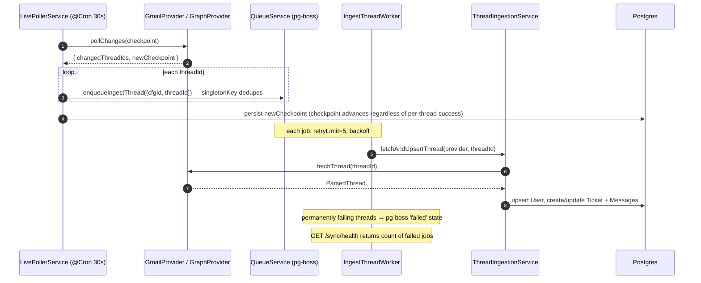
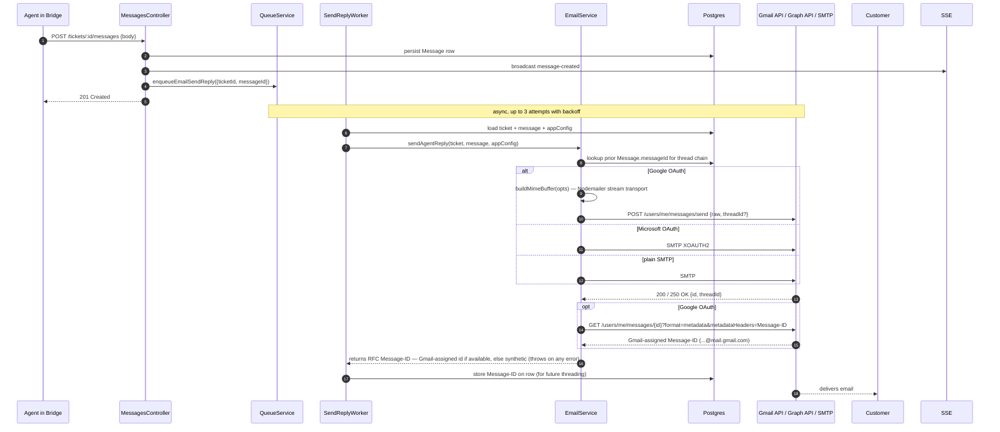

# Email

## What it does

Customers and agents have a real two-way email conversation that mirrors the ticket thread in Bridge.

- The org connects their support inbox via **OAuth (Google or Microsoft)**. Host/port come from env; OAuth flow stores encrypted tokens.
- **Outbound**: when an agent replies in Bridge, the customer receives a real email from the support address, threaded into the existing Gmail conversation.
- **Inbound (live)**: a 30-second cron job polls the provider REST API for new mail and routes it to the correct ticket (or creates a new one).
- **Inbound (historical)**: on first OAuth connect, the full unbounded inbox archive is processed in the background (no cap, no time limit). A `gmailHistoryId` / `graphDeltaLink` checkpoint is set at archive **start** so live mail arriving during the archive is not missed. Live mail always has priority over backfill.

## Stack

| Layer | Library / service | Why |
|---|---|---|
| Gmail inbound | Gmail REST API (`history.list`, `threads.get`) | No IMAP — works with Google Workspace accounts that block IMAP |
| Microsoft inbound | Microsoft Graph REST API (`messages/delta`, `conversationId` grouping) | Consistent with Google; OAuth scopes `Mail.ReadWrite Mail.Send` |
| Gmail outbound | Gmail REST API (`users.messages.send`) | Avoids the `https://mail.google.com/` SMTP scope; uses narrow `gmail.modify + gmail.send`. Nodemailer still builds MIME; the raw RFC 2822 buffer is base64url-POSTed to the API |
| Microsoft outbound | Microsoft Graph `/me/sendMail` | Unchanged |
| Plain-SMTP fallback | `nodemailer` SMTP | Dev/seed flow (no OAuth configured) |
| Sync dispatcher | `LivePollerService` (30 s cron) + `email:ingest-thread` pg-boss queue | Thin: fetches changed thread IDs → enqueues one durable job per thread → advances checkpoint. Per-thread retry/dead-letter via pg-boss |
| Sync worker | `IngestThreadWorker` | Consumes `email:ingest-thread`; calls `ThreadIngestionService.fetchAndUpsertThread`. 5 retries, exponential backoff. Failed jobs surface in Bridge via `GET /sync/health` |
| Cron | `@nestjs/schedule` + `@Cron` | 30-second tick; **on by default** — set `EMAIL_SYNC_LIVE_POLL=0` to disable |
| Credential encryption | Node `crypto` (AES-256-GCM) | OAuth tokens stored encrypted at rest |
| Threading | RFC 5322 `Message-ID` / `In-Reply-To` / `References` + Gmail `threadId` | Real headers anchor the customer's mail client. For Gmail **sending**, headers alone are not enough — the send body must carry the conversation's `threadId`. `EmailService` captures the `threadId` Gmail returns on the first outbound and stamps it onto `Ticket.externalThreadId` (when null) so confirmation + agent replies thread in the support Gmail. See R217. Gmail also **rewrites the sender-supplied `Message-ID`** on send — `EmailService.gmailApiSend` does a follow-up `GET messages/{id}?format=metadata&metadataHeaders=Message-ID` to capture the assigned `...@mail.gmail.com` id, which is what gets persisted and chained into `References`/`In-Reply-To` for the *recipient's* mailbox. See R218. |

## Inbound live-poll flow (dispatcher/importer split)

The live poller is a **thin dispatcher**: it fetches changed thread IDs from the provider, enqueues one durable `email:ingest-thread` pg-boss job per thread, then advances the checkpoint. The actual ingestion happens in `IngestThreadWorker`, which runs concurrently with per-thread retry and dead-lettering.



**Why enqueue before advancing the checkpoint?** A crash between the enqueue and the checkpoint write is harmless — the next poll re-finds the same threads, but pg-boss's `singletonKey` dedupes them. A crash between advancing the checkpoint and the enqueue would silently lose threads, which is the dangerous scenario the dispatcher avoids.

## Inbound backfill flow (on OAuth connect)

```mermaid
sequenceDiagram
  autonumber
  participant OAuthSvc as EmailOAuthService
  participant Events as AppEventsService
  participant Backfill as EmailSyncBackfillService
  participant Provider as GmailProvider / GraphProvider
  participant Ingestion as ThreadIngestionService
  participant DB as Postgres

  OAuthSvc->>DB: store encrypted tokens
  OAuthSvc->>Events: emitOAuthConnected(cfgId)
  Events-->>Backfill: onOAuthConnected listener fires
  Backfill->>Provider: fetchAliases() — build alias set
  Backfill->>DB: archiveStatus = RUNNING
  Backfill->>Provider: fetchCurrentHistoryId() — capture checkpoint BEFORE processing
  Backfill->>DB: persist gmailHistoryId / graphDeltaLink (so live poll catches up after archive)
  Backfill->>Provider: fetchTotalThreadCount() — estimate for progress display
  Backfill->>DB: persist archiveTotalEstimate
  Backfill->>Backfill: runBackgroundArchive() — unbounded pagination
  Note over Backfill: pageToken preserved on cancel; resume continues from last page
  loop background pages
    Backfill->>DB: persist archivePageToken after each page
    Backfill->>DB: check for CANCELLED between pages
  end
  Backfill->>DB: archiveStatus = DONE
  Backfill->>DB: update gmailHistoryId / graphDeltaLink to current (post-archive)
```

## Outbound flow (retried via queue)

Agent replies and portal-reply acks all go through pg-boss queues, retried up to 3× with exponential backoff. On permanent failure an `email_delivery_failed:` SYSTEM_EVENT appears in the ticket thread. **Errors always propagate** from `sendAgentReply`, `sendPortalReplyAck`, and `sendTicketConfirmation` — the workers' retry + failure event logic only fires if the send actually throws.

### Agent reply (`email:send-reply`)



### Portal reply ack (`email:send-reply`, `kind: 'portal-copy'`, G1)

When a customer posts a reply via the portal and `AppConfig.mirrorPortalRepliesToEmail = true`, `MessagesService` enqueues an additional job with `kind: 'portal-copy'`. `SendReplyWorker` branches on the `kind` field and calls `EmailService.sendPortalReplyAck()` instead of `sendAgentReply()`. The ack:
- Is sent **To the customer** (not the support address) with **Reply-To** set to the support address
- Subject: `Re: [REF] <title>` — threaded into the existing conversation via `buildThreadHeaders` + `externalThreadId`
- Body: `Hi <name>,\n\nReceived your response:\n\n<message.body>\n\n— <appName> Support Team`
- Stores the returned Message-ID on the `Message` row for RFC dedup

The poller's RFC-messageId dedup filter (`messageId @unique`) skips the ack on the next poll cycle — the Message-ID stamped on the portal `Message` row matches the sent email's id, so the poller never re-ingests it as a new message.

### Ticket confirmation (`email:send-confirmation`, G2)

When `TicketsService.activateTicket()` fires (portal ticket creation, or **Convert** on an inbound email conversation), a job is enqueued in `email:send-confirmation`. `SendConfirmationWorker` sends the confirmation:

1. **Idempotency check** — looks for an existing `confirmation_sent:` SYSTEM_EVENT on the ticket; skips if found.
2. **Send** — calls `EmailService.sendTicketConfirmation(ticket, appConfig)` which **throws on failure**.
3. **Paper-trail marker** — creates `confirmation_sent:{email}` SYSTEM_EVENT with `messageId` set to the RFC Message-ID returned by `sendTicketConfirmation` — the **Gmail-assigned** id (`...@mail.gmail.com`, captured via the follow-up `messages.get`, R218) when sending via Gmail, or the synthetic `<ticket-{emailThreadId}@domain>` root otherwise. This allows customer replies to the confirmation to be matched at Level 2 (RFC Message-ID) instead of falling through to the Level-3 regex, and lets `buildThreadHeaders` chain `References` from the real delivered id.
4. **Final-failure marker** — after all retries exhausted, writes `email_delivery_failed:Confirmation…` SYSTEM_EVENT.

Retry profile: 3 attempts, 30 s delay, exponential backoff (same as `email:send-reply`).

## Delta-quoting (confirmation only — agent replies are quote-free)

The confirmation email quotes the customer's own portal description under a `Your message:` heading
so they see their message back as proof of receipt. Agent/bot reply emails contain **no quoted
history** — the thread lives in the email client's native chain, and the portal-reply ack puts portal
messages into the email thread on both sides.

- **`EmailService.loadUndeliveredHistory(ticketId, excludeMessageId?)`** — finds customer-facing
  `REPLY` messages on the ticket where `customerEmailedAt IS NULL`, `deletedAt IS NULL`,
  `isInternal = false`, and `sentVia` is `null` or not `EMAIL` (portal-authored or bot-authored
  content not yet emailed). Used by `sendTicketConfirmation` only. The
  `OR: [{ sentVia: null }, { sentVia: { not: 'EMAIL' } }]` form is required — Prisma's
  `{ not: 'EMAIL' }` alone compiles to `<> 'EMAIL'` in SQL, which excludes `NULL` rows under
  three-valued logic and would silently skip every portal message.
- **`EmailService.renderQuotedHistory(messages)`** — formats each message as
  `On <date>, <author> wrote:` followed by `> `-prefixed lines. Used by `sendTicketConfirmation` only.
- **`sendTicketConfirmation`** appends the rendered delta under a `Your message:` heading when non-empty.
- **`sendAgentReply`** sends the reply body, a "View full thread" link, and the sign-off — **no quoted block**. Returns `{ messageId, quotedMessageIds: [] }`.
- **`EmailService.markMessagesEmailed(messageIds)`** — sets `customerEmailedAt = now()` on the
  given ids (`updateMany`, idempotent). Called by:
  - `SendConfirmationWorker` — marks every id in `quotedMessageIds` after the confirmation sends.
  - `SendReplyWorker` (non-portal-copy branch) — marks `[messageId]` (the agent's own message; `quotedMessageIds` is always empty).
  - `BotService` (bot auto-reply path) — same as the agent-reply worker.
- **Ingestion pre-marking** — `ThreadIngestionService` sets `customerEmailedAt: msg.sentAt` when
  creating a `Message` row from an inbound email. That message *is* the email the customer
  received — it must never be re-quoted back at them.

**Follow-up (not done)**: confirmation quoting is **text-only** (`body`, not `bodyHtml`). HTML-quoted
history (matching Gmail's `gmail_quote` collapsed-history convention) is a documented follow-up.

## Bounce detection (G4)

`ThreadIngestionService.fetchAndUpsertThread()` runs a pre-ingest check on the first message's `fromEmail`:

```
BOUNCE_PATTERN = /^(mailer-daemon|postmaster|bounce|bounces|noreply|no-reply|no\.reply|donotreply|do-not-reply|auto-reply|autoreply)(@|$)/i
```

On a match, `handleBouncedThread()` is called and the normal ingest path is **skipped** (no User upsert, no Ticket created for the DSN thread). The method:

1. Collects all `<messageId@...>` tokens from the body text and looks them up in `Message.messageId` (Pattern 1 — matches our sent Message-IDs).
2. Falls back to scanning for `ticket-{emailThreadId}@` tokens and looking up `Ticket.emailThreadId` (Pattern 2 — synthetic confirmation Message-ID root).
3. On match: calls `writeBounceEvent(ticketId, userId)` which:
   - Creates an `email_delivery_failed:bounce` SYSTEM_EVENT on the ticket
   - Sets `User.emailStatus = 'BOUNCING'`
4. No match: logs a debug message and falls through to normal ingest (DSN from an unrelated sender).

The bounce handler is wrapped in a try/catch — a failure in `handleBouncedThread` logs `WARN` but does not block the ingestion (the `{ created: false }` short-circuit still applies).

Bridge shows a "email bouncing" / "email blocked" chip next to the customer email in the ticket sidebar when `emailStatus` ≠ `ACTIVE`.

### Inbound email — conversation vs ticket

When `ThreadIngestionService` creates a new row from an inbound email it is a **conversation** (`isTicket = false`, `status = NEW`):

- Every row (conversation and real ticket) gets a **`ref`** — a 7-char Crockford base32 unique code generated on insert. The code is always present in the DB but **not rendered** in the UI unless `isTicket = true`.
- `isBulk = true` if the message is bulk/automated — no functional change; the same `isBulkSender()` signal now sets `User.category = 'PROMOTIONAL'` on first email.

**User.category** is set **once** at user creation (from the first email):
- `PROMOTIONAL` if `isBulk = true`; `CUSTOMER` otherwise
- Agents can manually set it to `CUSTOMER`, `MARKETING`, or `PROMOTIONAL` via `PATCH /users/:id`
- The category is **never overwritten** by subsequent emails

**No** confirmation email and **no** bot response are sent on ingest. The agent opens the conversation in Bridge and clicks **Convert to ticket** in the sidebar to activate it — that sets `isTicket=true`, `status=OPEN` and fires `TicketsService.activateTicket()` (sends confirmation + enqueues bot). Clicking **Dismiss** sets `status = DISMISSED` without contacting the customer.

**Unified Inbox** — agents see all conversations and real tickets in one list (`/inbox`), grouped **Domain → conversations** (2-level; the sender is shown inline on each row, clustered by consecutive sender). Dismissed rows are excluded from the list. Conversations show no code badge; real tickets show the `ref` badge.

#### Bulk detection signals (`isBulkSender`)

`apps/api/src/modules/email-sync/util/is-bulk-sender.ts` — shared by both Gmail and Graph providers:
- `Auto-Submitted` header present and ≠ `no` (RFC 3834)
- `Precedence` ∈ {bulk, list, junk}
- `List-Unsubscribe` or `List-Id` header present
- `X-Auto-Response-Suppress` header present
- Sender local-part matches `no-?reply` / `donotreply` / `mailer-daemon` / `postmaster`

### Escalation notification (scenarios 7 + 9)

`BotService.escalateToHuman()` (called from both `MessagesService` and `ThreadIngestionService`) sends a brief "a specialist will follow up" email to the customer via `EmailService.sendEscalationNotification()` when `opts.notifyCustomer = true`.

## Provider interface

Both Gmail and Microsoft Graph implement `IMailProvider`:

| Method | Description |
|---|---|
| `listThreadIdsSince(since, cap?)` | Lists thread IDs since a date (backfill foreground) |
| `listAllThreadIds(pageToken?)` | Paginated full archive (background) |
| `fetchThread(threadId)` | Returns `ParsedThread` with all messages |
| `pollChanges(checkpoint)` | Returns new thread IDs + next checkpoint (live poll) |
| `fetchAliases()` | Returns all send-as alias addresses for the account |
| `isStaleCheckpointError(err)` | Detects 404 (Gmail) / 410 (Graph) stale-state errors |
| `recoverFromStaleCheckpoint()` | Falls back to re-listing last 7 days |

## Customer resolver

`CustomerResolverService.resolveCustomer(thread, aliases)`:
1. Collects all `from` addresses across thread messages.
2. Filters out any address that matches the agent's own aliases.
3. Picks the most-frequent remaining address as the customer.
4. The agent's address **never** becomes a `User` row.

## Token refresh

`TokenRefresher` dedupes concurrent refresh calls via `refreshLocks: Map<string, Promise<string>>`. Access token refreshed automatically when within 5 minutes of `oauthTokenExpiresAt`.

## Stale checkpoint recovery

- **Gmail**: `history.list` returns 404 when `historyId` has expired → re-list last 7 days, re-derive a fresh `historyId` from the profile.
- **Microsoft**: `messages/delta` returns 410 (`SyncStateNotFound`) → same fallback, rebuild delta link from last 7 days.

## Inbound email attachments (Gmail)

`parseGmailMessage()` in `GmailProvider` now walks `payload.parts` recursively. For each part where `filename` is non-empty and `body.attachmentId` exists, a `ParsedAttachment` entry is added to the returned `ParsedMessage`.

After the DB transaction completes in `ThreadIngestionService.fetchAndUpsertThread()`, attachments are fetched and stored:

1. `GmailProvider.fetchAttachmentBytes(gmailMessageId, gmailAttachmentId)` — `GET /gmail/v1/users/me/messages/{id}/attachments/{attachmentId}`, decodes base64url.
2. `FilesService.storeBuffer(bytes, { filename, mimeType, size, ticketId, messageId })` — MinIO PUT + presigned URL + `prisma.attachment.create()`.

Attachment fetch runs **outside** the DB transaction (HTTP calls must not run inside a Postgres transaction).

Safety bounds:
- Attachments larger than **25 MB** are skipped with a warning log.
- A failure on one attachment logs an error and continues — it never fails the whole ingest.
- Both providers now implement `fetchAttachmentBytes`. The capability check is via duck-typing: `'fetchAttachmentBytes' in provider`.

### Microsoft Graph attachments (G5)

`GraphProvider.fetchThread()` selects `hasAttachments` per message. When `hasAttachments = true`, it fetches the attachment list via `GET /me/messages/{id}/attachments?$select=id,name,contentType,size,contentBytes` and maps each to a `ParsedAttachment`. `fetchAttachmentBytes(messageId, attachmentId)` decodes the `contentBytes` base64 field from that endpoint. The `gmailMessageId` / `gmailAttachmentId` fields in `ParsedAttachment` are repurposed as provider-opaque IDs (Graph message and attachment IDs are stored there for the Graph path).

## At-least-once semantics

Checkpoint (historyId / deltaLink / archivePageToken) is persisted to DB **after** the batch is processed, not before. Crashes mid-batch replay the batch on restart. Idempotency is on `Ticket.externalThreadId @unique` and `Message.externalMessageId @unique`.

## Key files

| File | Role |
|---|---|
| [`apps/api/src/modules/email-sync/providers/mail-provider.interface.ts`](../../apps/api/src/modules/email-sync/providers/mail-provider.interface.ts) | `IMailProvider` interface — single pipeline, two adapters |
| [`apps/api/src/modules/email-sync/providers/gmail.provider.ts`](../../apps/api/src/modules/email-sync/providers/gmail.provider.ts) | Gmail REST adapter (`history.list`, `threads.get`, `settings/sendAs`) |
| [`apps/api/src/modules/email-sync/providers/graph.provider.ts`](../../apps/api/src/modules/email-sync/providers/graph.provider.ts) | Microsoft Graph adapter (`messages/delta`, `conversationId` grouping) |
| [`apps/api/src/modules/email-sync/providers/provider-factory.ts`](../../apps/api/src/modules/email-sync/providers/provider-factory.ts) | `for(cfg)` — creates the right provider, builds alias list |
| [`apps/api/src/modules/email-sync/thread-ingestion.service.ts`](../../apps/api/src/modules/email-sync/thread-ingestion.service.ts) | Provider-agnostic pipeline: upsert User/Ticket/Messages, enqueue AI for live, broadcast SSE |
| [`apps/api/src/modules/email-sync/customer-resolver.service.ts`](../../apps/api/src/modules/email-sync/customer-resolver.service.ts) | Picks non-alias sender; agent address never becomes a User row |
| [`apps/api/src/modules/email-sync/email-sync-backfill.service.ts`](../../apps/api/src/modules/email-sync/email-sync-backfill.service.ts) | OAuth-connect trigger + unbounded background archive; `resumeArchive()` preserves pageToken |
| [`apps/api/src/modules/email-sync/live-poller.service.ts`](../../apps/api/src/modules/email-sync/live-poller.service.ts) | `@Cron('*/30 * * * * *')`, gated by `EMAIL_SYNC_LIVE_POLL=1`; per-thread try/catch; always advances checkpoint |
| [`apps/api/src/modules/email-sync/email-sync.controller.ts`](../../apps/api/src/modules/email-sync/email-sync.controller.ts) | `POST /sync/backfill/run`, `GET /sync/status`, `POST /sync/archive/cancel`, `POST /sync/archive/resume`, `POST /sync/poll/now`, `POST /sync/resync` |
| [`apps/api/src/common/logger/file-logger.ts`](../../apps/api/src/common/logger/file-logger.ts) | `FileLogger extends ConsoleLogger` — writes daily JSON log files to `apps/api/logs/app-YYYY-MM-DD.log` |
| [`apps/api/src/modules/email-sync/email-sync.module.ts`](../../apps/api/src/modules/email-sync/email-sync.module.ts) | Module wiring; imports `ScheduleModule.forRoot()` |
| [`apps/api/src/modules/email-sync/util/with-retry.ts`](../../apps/api/src/modules/email-sync/util/with-retry.ts) | Exponential backoff for 429 rate-limit errors (5s, 10s, 20s, max 3 retries) |
| [`apps/api/src/modules/email/email.service.ts`](../../apps/api/src/modules/email/email.service.ts) | Outbound: `nodemailer` (OAuth2) for Google, `sendViaGraph()` for Microsoft |
| [`apps/api/src/modules/email-oauth/email-oauth.service.ts`](../../apps/api/src/modules/email-oauth/email-oauth.service.ts) | OAuth auth URL generation, code exchange, token storage for Google + Microsoft |
| [`apps/api/src/modules/email-oauth/email-oauth.controller.ts`](../../apps/api/src/modules/email-oauth/email-oauth.controller.ts) | `GET /config/email/oauth/:provider/start`, callback, disconnect |
| [`apps/api/src/modules/email-oauth/token-refresher.ts`](../../apps/api/src/modules/email-oauth/token-refresher.ts) | Checks `oauthTokenExpiresAt`, deduped refresh via `refreshLocks` map |
| [`apps/api/src/common/crypto/credentials-cipher.ts`](../../apps/api/src/common/crypto/credentials-cipher.ts) | AES-256-GCM encrypt/decrypt for OAuth tokens |
| [`apps/bridge/src/app/settings/email/page.tsx`](../../apps/bridge/src/app/settings/email/page.tsx) | Settings → Email UI: method picker (Google/Microsoft), connected state, archive progress |
| [`apps/bridge/src/components/settings/email/MethodPicker.tsx`](../../apps/bridge/src/components/settings/email/MethodPicker.tsx) | Google + Microsoft auth method cards |
| [`apps/bridge/src/components/dashboard/ArchiveProgressCard.tsx`](../../apps/bridge/src/components/dashboard/ArchiveProgressCard.tsx) | Archive progress card: shows "X / Y emails retrieved" (foreground) or "X emails retrieved" (background); proportional or indeterminate bar; Cancel / Pull again buttons |
| [`apps/bridge/src/lib/useBackfillStatus.ts`](../../apps/bridge/src/lib/useBackfillStatus.ts) | Polls `GET /api/v1/sync/status` (5s when RUNNING, 30s otherwise); subscribes to `archive-progress` SSE; takes `Math.max` on `archiveTotalSeen` to prevent stale poll overwriting SSE count |
| [`apps/bridge/src/lib/useEmailConfig.ts`](../../apps/bridge/src/lib/useEmailConfig.ts) | Polls `GET /api/v1/config`; `isConnected` = `oauthConnected` |

## Endpoints

**OAuth** (on `EmailOAuthController`, prefix `config/email/oauth`):
| Method | Path | Description |
|---|---|---|
| `GET` | `/config/email/oauth/:provider/start` | Returns OAuth auth URL |
| `GET` | `/config/email/oauth/:provider/callback` | Exchanges code, stores tokens, redirects to Bridge |
| `DELETE` | `/config/email/oauth/disconnect` | Clears OAuth tokens + resets archive state |

**Sync** (on `EmailSyncController`, prefix `sync`):
| Method | Path | Description |
|---|---|---|
| `POST` | `/sync/backfill/run` | Trigger full unbounded background archive (sets checkpoint first) |
| `GET` | `/sync/status` | Returns `{ archiveStatus, archiveTotalSeen, archiveTotalEstimate }` |
| `GET` | `/sync/health` | Returns `{ failedIngestJobs: N }` — count of `email:ingest-thread` jobs in pg-boss 'failed' state |
| `POST` | `/sync/archive/cancel` | Sets `archiveStatus = CANCELLED` (preserves pageToken for resume) |
| `POST` | `/sync/archive/resume` | Resumes cancelled archive from saved pageToken (no restart) |
| `POST` | `/sync/poll/now` | Manually trigger one live-poll cycle for all active OAuth configs |
| `POST` | `/sync/resync` | Clears checkpoint and triggers full re-sync |

## Data model touched

**`AppConfig`**: `oauthProvider`, `oauthEmail`, `oauthAccessTokenEnc`, `oauthRefreshTokenEnc`, `oauthTokenExpiresAt`, `oauthScopes`, `oauthAliases[]`, `gmailHistoryId`, `graphDeltaLink`, `archivePageToken`, `archiveStatus`, `archiveTotalSeen`, `archiveTotalEstimate`, `mirrorPortalRepliesToEmail` (G1, default `true`).

**`Ticket`**: `externalThreadId @unique`, `externalProvider` (GMAIL/GRAPH), `source = EMAIL`. **`Message`**: `externalMessageId @unique`, `messageId`, `inReplyTo`, `bodyRaw`, `customerEmailedAt DateTime?` (delta-quoting watermark, indexed `[ticketId, customerEmailedAt]`). **`User`**: `source = EMAIL`, `emailStatus` (ACTIVE / BOUNCING / BLOCKED — set to BOUNCING by `writeBounceEvent()`, G4).

See [_generated/erd.md](_generated/erd.md) for the full ERD.

## Environment variables

| Var | Default | Purpose |
|---|---|---|
| `SMTP_HOST` | `smtp.gmail.com` | SMTP server (used only for non-OAuth/Microsoft SMTP fallback) |
| `SMTP_PORT` | `587` | SMTP port (STARTTLS) |
| `EMAIL_CREDS_KEY` | (required) | AES-256-GCM key for OAuth token encryption — `openssl rand -hex 32` |
| `GOOGLE_OAUTH_CLIENT_ID` | (optional) | Google Cloud Console OAuth client ID |
| `GOOGLE_OAUTH_CLIENT_SECRET` | (optional) | Google Cloud Console OAuth client secret |
| `MICROSOFT_OAUTH_CLIENT_ID` | (optional) | Azure Entra app registration client ID |
| `MICROSOFT_OAUTH_CLIENT_SECRET` | (optional) | Azure Entra app registration client secret |
| `OAUTH_CALLBACK_BASE` | `http://localhost:3001` | **API** base URL for OAuth redirect URIs |
| `BRIDGE_URL` | `http://localhost:3002` | Bridge base URL — post-OAuth browser redirect target |
| `EMAIL_SYNC_LIVE_POLL` | on by default | Set to `0` to disable the 30s live-poll cron |

### Google OAuth scopes (after migration)

`https://www.googleapis.com/auth/gmail.modify https://www.googleapis.com/auth/gmail.send email profile`

Previously used the full `https://mail.google.com/` scope to support SMTP XOAUTH2. Now that Gmail outbound uses the REST API, the narrower scopes suffice:
- `gmail.modify` — read/modify messages (inbound polling, history, thread fetch)
- `gmail.send` — send messages via REST API

**Existing connected accounts hold the old scope and must re-authorize** via Settings → Email → Disconnect → Reconnect to receive the narrower scope.

### OAuth redirect URIs to register in provider console

- Google Cloud Console → OAuth 2.0 Client → Authorized redirect URIs: `{OAUTH_CALLBACK_BASE}/api/v1/config/email/oauth/google/callback`
- Azure Entra → App registration → Redirect URIs: `{OAUTH_CALLBACK_BASE}/api/v1/config/email/oauth/microsoft/callback`

## Email-connected gate (Bridge)

When email is not configured (`!oauthConnected`), Bridge shows a full-page gate on `/inbox`, `/tickets`, and `/tickets/[id]`. Sidebar remains accessible so ADMIN agents can navigate to Settings → Email to connect.

- `useEmailConfig(token)` — module-level cached `GET /config` call; `isConnected = oauthConnected`. Cache invalidated on `refresh()`.
- `EmailNotConfiguredGate` — ADMIN gets "Connect email" CTA → `/settings/email`; non-ADMIN gets "ask your admin" message.

## Notable decisions

- **IMAP fully removed** — Gmail REST API (`history.list`) and Microsoft Graph (`messages/delta`) replace `imapflow`. No IDLE connections, no mailbox lock contention, no extra infra. Works with Google Workspace accounts that disable IMAP.
- **Single `IMailProvider` interface** — one ingestion pipeline (`ThreadIngestionService`) works for both Gmail and Microsoft. Provider-specific code lives only in the adapters.
- **Unlimited archive (no 300-thread / 180-day cap)** — removed `FOREGROUND_MAX_THREADS = 300` and `FOREGROUND_DAYS = 180`. Archive is now a single unbounded background phase with no time or count limit.
- **Checkpoint set at archive START, not end** — `setInitialCheckpoint()` is called before any thread is processed. If mail arrives during a long archive, the live poller can pick it up immediately after `archiveStatus = DONE`. Checkpoint is also refreshed at completion to advance past the archive itself.
- **Per-thread error isolation in live poller** — each `fetchAndUpsertThread` call is wrapped in try/catch. A single bad thread logs a warning and continues; the checkpoint always advances after the loop. Previously, one failing thread blocked the checkpoint forever → infinite retry every 30s.
- **`messagesAdded` checked before `messages` in Gmail history** — `history[].messagesAdded[].message.threadId` is more reliable than `history[].messages[].threadId` (which only appears on some entry types). Fixes missed threads on first-ever poll.
- **3-level In-Reply-To matching for portal tickets** — portal tickets have `externalThreadId = null` until linked. When a customer replies to a confirmation email the poller resolves the ticket via: (1) `externalThreadId` fast path, (2) agent reply `Message-ID` in `Message.messageId`, (3) parse `<ticket-{emailThreadId}@domain>` from the synthetic confirmation `Message-ID` and look up `Ticket.emailThreadId`. On match, stamps `externalThreadId` for future fast-path lookups.
- **RFC messageId dedup before `message.create()`** — Gmail includes a sent email twice (Inbox + Sent copy) with different Gmail IDs but identical RFC `Message-ID`. The `externalMessageId` check passes but `messageId @unique` would throw P2002. Fix: `findUnique({ where: { messageId: rfcMessageId } })` → skip if exists.
- **Cancel preserves pageToken; resume continues mid-archive** — `POST /sync/archive/cancel` sets `archiveStatus = CANCELLED` only. `POST /sync/archive/resume` sets status back to `RUNNING` and calls `runBackgroundArchive()` which reads the saved `archivePageToken`. No restart from beginning.
- **Ticket timestamps from actual email dates** — `Ticket.createdAt` = `sentAt` of first message; `Ticket.updatedAt` = `sentAt` of latest message. Existing tickets receiving a new reply update `updatedAt` to the new message's `sentAt`. Avoids all tickets showing the import timestamp.
- **Daily rotating JSON log files** — `FileLogger extends ConsoleLogger` writes `{"ts","level","context","msg"}` JSON lines to `apps/api/logs/app-YYYY-MM-DD.log`. Enables post-hoc debugging without needing a terminal session open. Tail with: `tail -f apps/api/logs/app-$(date +%Y-%m-%d).log | jq -r '[.ts,.level,.context,.msg] | @tsv'`.
- **At-least-once semantics, idempotent upserts** — checkpoint persisted after processing. `externalThreadId @unique` + `externalMessageId @unique` makes replays safe.
- **Stale checkpoint auto-recovery** — Gmail 404 or Graph 410 → re-list last 7 days, re-derive checkpoint. No manual intervention needed.
- **AppEventsService for backfill trigger** — `EmailOAuthService` emits `OAUTH_CONNECTED`; `EmailSyncBackfillService` listens. Avoids circular module dependency (EmailSyncModule imports EmailOAuthModule).
- **OAuth callback on the API, not Bridge** — auth code never touches Bridge request logs; API exchanges it server-side and redirects browser to Bridge with `?connected=1`.
- **`EMAIL_SYNC_LIVE_POLL=1` gate** — live polling is off by default. Dev environments can leave it off; prod sets it explicitly.
- **Background archive resumes on restart** — `OnApplicationBootstrap` in `EmailSyncBackfillService` checks for `archiveStatus === RUNNING` and resumes from `archivePageToken`.
- **`processBatch` callback is async; DB write awaited before SSE** — originally the chunk callback used fire-and-forget `void db.update()`. SSE could broadcast a count before the DB committed it; the next poll would then return 0 and overwrite the UI counter. Making the callback `async` and awaiting the write fixes the race.
- **`useBackfillStatus` takes `Math.max` on poll** — the poll `setStatus` uses `Math.max(polled.archiveTotalSeen, prev.archiveTotalSeen)` so a stale poll response can never roll back a higher count already set by an SSE event.
- **`archiveTotalEstimate` persisted before first chunk** — the total thread count for the foreground phase is saved to `AppConfig.archiveTotalEstimate` before `processBatch` starts, so the very first poll returns the denominator for the `X / Y` display. Background archive has no known total; the UI shows an indeterminate bar instead.
- **Concurrent user upsert — P2002 fallback** — `user.upsert()` outside the transaction can still race when 5 threads process the same customer email simultaneously. Fix: catch `P2002` (`PrismaClientKnownRequestError`) and fall back to `findUnique` — the winning thread already inserted the row.
- **DISMISSED → NEW resurface on customer reply** — `ThreadIngestionService` checks the current ticket status inside the `!wasCreated` update block. If the status is `DISMISSED` and the new message is from a customer (non-agent, `newMessageId` is set), it flips `status = 'NEW'` in the same `tx.ticket.update()` call. This returns the thread to the agent Inbox for re-triage without sending any customer email (ticket is still pre-activation).
- **No AI on backfill messages** — prevents cost spikes on thousands of historical messages. "Run AI on imported emails" gives explicit control back to the admin.
- **Portal reply ack to customer, not self-addressed mirror (G1)** — when a customer replies from the portal, `sendPortalReplyAck` sends a "Received your response" email directly to the customer (From=support, To=customer, Reply-To=support), threaded into the existing conversation. This puts the portal message into the email thread on both sides (customer inbox + support Sent) without the awkward self-addressed mirror. The returned Message-ID is stamped on the portal `Message` row so the poller's `messageId @unique` guard skips the ack on the next poll — no duplicate in the ticket thread.
- **Confirmation email via queue, not direct call (G2)** — moved `sendTicketConfirmation()` from a direct awaited call in `activateTicket()` to a pg-boss job. Benefit: the HTTP response to the portal user is no longer blocked by SMTP latency. Idempotency via `confirmation_sent:` SYSTEM_EVENT prevents double-send on retry.
- **Bounce detection skips user upsert (G4)** — `handleBouncedThread()` fires before the `user.upsert()` block; a bounce from mailer-daemon never creates a phantom User row for the delivery system sender.
- **Graph attachment IDs stored in Gmail-named fields (G5)** — `ParsedAttachment.gmailMessageId` / `gmailAttachmentId` are repurposed as provider-opaque IDs to avoid adding a new interface field. Graph message and attachment IDs are stored there for the Graph path; GmailProvider continues to use them for Gmail IDs. Both providers now implement `fetchAttachmentBytes`.
- **TokenRefresher dedupes concurrent refreshes** — `refreshLocks: Map<string, Promise<string>>` ensures two concurrent sends don't both try to refresh the token, causing one to store a stale token.
- **`customerEmailedAt` nullable watermark, not a boolean** — a nullable `DateTime?` records *when* a message was delivered to the customer's inbox, matching the `analyzedAt`/`deletedAt` conventions elsewhere on `Message`. Quoting logic (`loadUndeliveredHistory`) and marking logic (`markMessagesEmailed`) live centrally in `EmailService`, not duplicated per worker.
- **Delta-quoting in confirmation only** — the confirmation email quotes only messages with `customerEmailedAt = NULL` (the delta), not the entire ticket history. Agent/bot reply emails contain no quoted block — the thread lives in the email client's native chain, and the portal-reply ack puts portal messages into the email thread without re-quoting them at the customer.
- **CC on agent replies; TO-only policy for all other sends** — `sendAgentReply` reads `message.cc` (a `String[]` snapshot on the `Message` row) and passes it to nodemailer / Gmail MIME as the `cc:` field. The confirmation email, portal-reply ack, and escalation notification are intentionally TO-only — they must not blast an agent-curated CC list to the customer's own support chain. `makeCapturingTransport` records the `Cc` header and a top-level `cc` field in `CapturedMail` so E2E tests can assert on it.
- **Inbound per-message sender attribution** — `ThreadIngestionService` now resolves each message's `from:` address to its own `User` row (via `resolveSenderUser` helper) instead of always attributing to the thread-level customer. A CC'd third party who replies into the thread gets their own User row and is auto-added to `TicketParticipant` with `source=INBOUND`. `ticket.userId` (the primary customer) is never reassigned.

## Known gaps

- `OAUTH_CALLBACK_BASE` and `BRIDGE_URL` env vars must be set correctly in production; defaults only work for local dev.
- `User.emailStatus` has `BLOCKED` as a third state (Prisma enum) but nothing sets it to `BLOCKED` yet — reserved for a future manual block action.
- Portal reply ack (`mirrorPortalRepliesToEmail`) stores the returned Message-ID on the portal Message row for RFC dedup, but the poller still sees and skips the ack on the next cycle. If the poller runs very quickly after the send-reply worker, there is a small window where the ack Message-ID hasn't been committed yet. In practice this is benign: the idempotent `messageId @unique` constraint prevents duplicate Message rows.
- **Graph/SMTP also rewrite the sender Message-ID, but only the Gmail path captures the assigned id (R218)** — Microsoft Graph and plain SMTP relays can rewrite the outbound `Message-ID` the same way Gmail does, breaking recipient-side threading the same way, but `EmailService` has no equivalent follow-up lookup for those paths (`sendViaGraph` / SMTP transporter don't return an assigned id). Affected sends fall back to the synthetic/generated Message-ID for `References`/`In-Reply-To`. Follow-up: add a Graph `GET /me/messages/{id}` (or `Prefer: return=representation`) lookup analogous to the Gmail `messages.get` fix.
- **Delta-quoting is text-only** — `renderQuotedHistory` quotes `Message.body` (plain text), not `bodyHtml`. An HTML-aware quoted-history block (matching Gmail's `gmail_quote` convention) is a documented follow-up, not yet built.
- **`customerEmailedAt` on pre-existing rows** — every `Message` created before delta-quoting shipped has `customerEmailedAt = NULL`. This only affects the confirmation-email quoting path; since agent replies no longer quote history, there is no longer a "first-reply dumps the whole thread" scenario. The watermark is accurate for all messages ingested or created after deploy.
