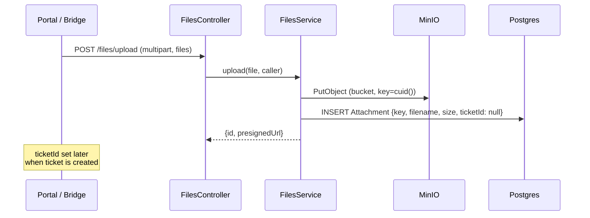

# Files

## What it does

File attachments for tickets and (eventually) messages. Live upload via `POST /files/upload`, served back via presigned GET URLs. Storage is MinIO (S3-compatible), which runs in Docker Compose for dev and any S3-compatible backend in prod.

## Upload flow

`Attachment.ticketId` is **optional** — files are uploaded before the ticket exists, then linked at create-time via the `attachmentIds: string[]` field on `CreateTicketDto`.

Uploads are capped at **10 MB server-side** — `FilesController` passes `limits: { fileSize: 10 * 1024 * 1024 }` to the `FileInterceptor`, so oversized files are rejected before reaching `FilesService`. Inbound **email attachments** are also ingested: `ThreadIngestionService` fetches attachment bytes from the provider after the DB transaction and stores them via `FilesService.storeBuffer()` (25 MB cap per attachment).

## Key files

| File | Role |
|---|---|
| [`apps/api/src/modules/files/files.controller.ts`](../../apps/api/src/modules/files/files.controller.ts) | HTTP surface |
| [`apps/api/src/modules/files/files.service.ts`](../../apps/api/src/modules/files/files.service.ts) | MinIO client, presigned URL signing |
| [`apps/portal/src/components/portal/FileDropzone.tsx`](../../apps/portal/src/components/portal/FileDropzone.tsx) | Customer drag-and-drop |

## Endpoints

See `FilesController` in [_generated/api-routes.md](_generated/api-routes.md#filescontroller).

## Environment variables

| Var | Default | Purpose |
|---|---|---|
| `MINIO_ENDPOINT` | `minio` | Host (Docker service name in dev) |
| `MINIO_PORT` | `9000` | S3 API port |
| `MINIO_ACCESS_KEY` | `minioadmin` | dev default |
| `MINIO_SECRET_KEY` | `minioadmin` | dev default |
| `MINIO_BUCKET` | `tmr-support` | Bucket name |

## Known gaps

- No virus scanning. Untrusted attachments could host malware.
- No file attach in reply composer (portal side has the paperclip icon but no handler).
