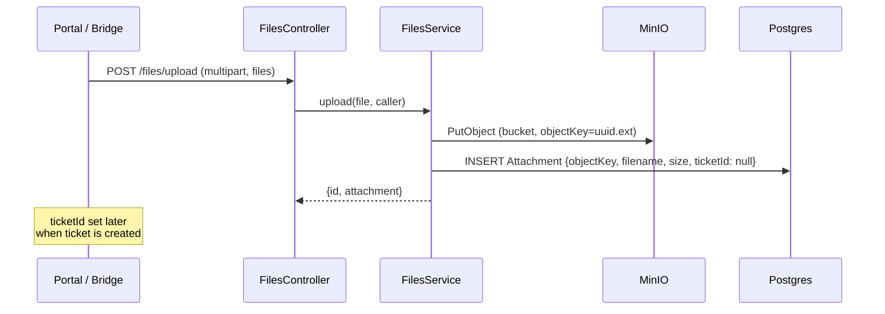

# Files

## What it does

File attachments for tickets and messages. Live upload via `POST /files/upload`; downloads are
served via **freshly-signed, short-lived URLs minted on click** through `GET /files/:id/sign`.
Storage is MinIO (S3-compatible) in dev and **E2E Object Storage** (also S3-compatible) in prod —
a single `@aws-sdk/client-s3` client (`forcePathStyle`) drives both; `S3_ENDPOINT` is a full URL
(scheme + port encode transport), passed straight to the SDK. The bucket is **not** auto-created —
it's a shared bucket that must be provisioned ahead of time (tests provision it in their setup).

## Upload flow

`Attachment.ticketId` is **optional** — files are uploaded before the ticket exists, then linked at create-time via the `attachmentIds: string[]` field on `CreateTicketDto`.

Uploads are capped at **10 MB server-side** — `FilesController` passes `limits: { fileSize: 10 * 1024 * 1024 }` to the `FileInterceptor`, so oversized files are rejected before reaching `FilesService`. Executable types (`.exe`, see `BLOCKED_UPLOAD_EXTENSIONS`) are rejected with a `400`. Inbound **email attachments** are also ingested: `ThreadIngestionService` fetches attachment bytes from the provider after the DB transaction and stores them via `FilesService.storeBuffer()` (25 MB cap per attachment).

## Download flow — sign on click

Download URLs are **not** persisted. Each `Attachment` row stores a durable `objectKey`; when the
user clicks an attachment, the frontend opens a blank tab and calls `GET /files/:id/sign` (with its
Bearer token). That endpoint **authorizes first** — an agent may sign any attachment, a customer
only attachments on a ticket they own (mirrors the upload IDOR guard) — then mints a fresh
short-lived presigned URL (`S3_READ_URL_TTL_SECONDS`, default **600 s / 10 min**) via
`FilesService.presignReadUrl`. Because signing happens at click time, links never go stale no
matter how long the page sat open, and a leaked URL expires within minutes.

Risky markup/executable types (`.html`, `.svg`, `.exe`) are signed with
`response-content-disposition: attachment` so they download instead of rendering inline (closes the
stored-XSS vector); images/PDFs preview inline as before. Link attachments (`isLink`) bypass signing
and return their stored URL.

> Historical note: pre-2026-06-23, `storeBuffer` minted a **7-day** presigned URL once at upload and
> stored it, so every link died 7 days after upload regardless of activity. Replaced by sign-on-click.
> Object bytes are never deleted or lifecycle-expired — only the URL signature is short-lived.

## Key files

| File                                                                                                             | Role                                |
| ---------------------------------------------------------------------------------------------------------------- | ----------------------------------- |
| [`apps/api/src/modules/files/files.controller.ts`](../../apps/api/src/modules/files/files.controller.ts)         | HTTP surface                        |
| [`apps/api/src/modules/files/files.service.ts`](../../apps/api/src/modules/files/files.service.ts)               | S3 client (`@aws-sdk/client-s3`), presigned URL signing |
| [`apps/portal/src/components/portal/FileDropzone.tsx`](../../apps/portal/src/components/portal/FileDropzone.tsx) | Customer drag-and-drop              |

## Endpoints

See `FilesController` in [\_generated/api-routes.md](_generated/api-routes.md#filescontroller).

## Environment variables

| Var                       | Default                 | Purpose                                                                        |
| ------------------------- | ----------------------- | ------------------------------------------------------------------------------ |
| `S3_ENDPOINT`             | `http://localhost:9000` | Full URL — scheme encodes transport (`http`/`https`) and port (e.g. `https://host` for prod E2E over 443). Bare host / `host:port` is rejected by the SDK. |
| `S3_ACCESS_KEY`           | _(empty)_               | Access key                                                                     |
| `S3_SECRET_KEY`           | _(empty)_               | Secret key                                                                     |
| `S3_BUCKET`               | `tmr-support`           | Bucket name (must be provisioned ahead of time)                                |
| `S3_REGION`               | `us-east-1`             | S3 region passed to the client (ignored by MinIO/E2E)                          |
| `S3_READ_URL_TTL_SECONDS` | `600`                   | Lifespan of a click-minted download URL                                        |

## Known gaps

- No virus scanning. Untrusted attachments could host malware. (Deferred — separate effort.)
- Upload extension block is minimal (`.exe` only); extend `BLOCKED_UPLOAD_EXTENSIONS` as needed.
