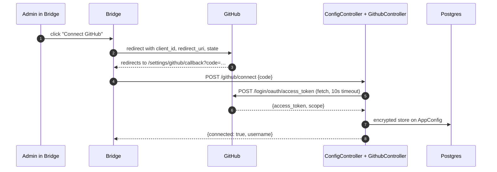
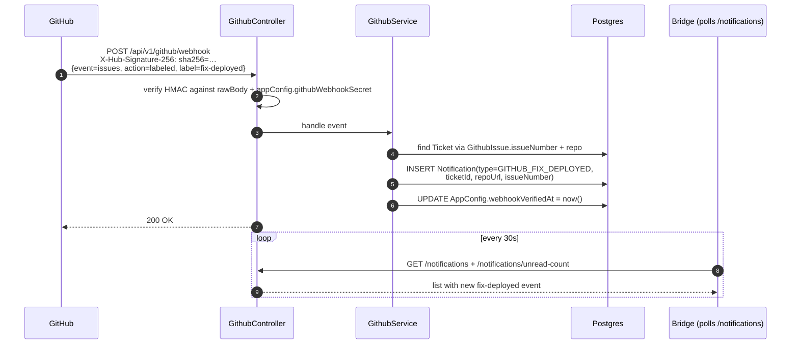
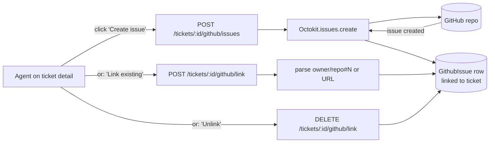

# GitHub

## What it does

Two-way connection between a ticket and a GitHub Issue:

1. **OAuth connect**: admin in Bridge clicks "Connect GitHub" → standard OAuth code-exchange flow → access token stored in `AppConfig`.
2. **Issue creation / linking**: from a ticket's GitHub panel, the agent creates a new issue in the configured default repo, or links an existing issue by URL / `owner/repo#123`.
3. **Webhook**: GitHub fires `issues` events at our endpoint. When a `fix-deployed` label is added to a linked issue, we create an in-app `Notification` for every agent and surface an amber banner on the ticket.
4. **Pending-confirmation flag**: agent can click "Mark pending customer confirmation" on a ticket — adds a `pending-customer-confirmation` label on the linked issue (and removes `fix-deployed` simultaneously).

## Stack

| Layer | Library / service | Why |
|---|---|---|
| API calls | `@octokit/rest` | Official GitHub SDK, types included |
| OAuth | Native `fetch` + `AbortSignal.timeout` | No extra OAuth lib needed for the code-exchange step |
| Webhook auth | HMAC-SHA256 via Node `crypto` | Standard GitHub webhook signature verification |
| Raw body | NestJS `rawBody: true` enabled in `main.ts` | Needed so HMAC sees the exact bytes GitHub signed |
| Webhook events | Polled-style `Notification` rows | All agents see all events; no per-agent scoping |

## OAuth flow

The callback page uses a `cancelled` ref so React Strict Mode double-invocation doesn't double-exchange the code, and the fetch has a 15s wrapper timeout in addition to the 10s SDK timeout.

## Webhook flow (fix-deployed)

The same path handles the inverse: when an agent presses "Mark pending" on a ticket, we call Octokit to add `pending-customer-confirmation` and remove `fix-deployed`. The next webhook for `unlabeled` arrives and we silently no-op (already reflected in DB).

## Issue creation from a ticket

A linked issue can be removed again via `DELETE /tickets/:id/github/link` (`GithubService.unlinkIssue()`), and `POST /tickets/:id/github/pending` marks the linked issue as pending-customer-confirmation (applies the configured pending label).

## Key files

| File | Role |
|---|---|
| [`apps/api/src/modules/github/github.controller.ts`](../../apps/api/src/modules/github/github.controller.ts) | All HTTP — OAuth, webhook, issue link, label management |
| [`apps/api/src/modules/github/github.service.ts`](../../apps/api/src/modules/github/github.service.ts) | Octokit calls, webhook HMAC verify, label add/remove |
| [`apps/api/src/main.ts`](../../apps/api/src/main.ts) | `rawBody: true` enabled (required for signature verification) |
| [`apps/bridge/src/app/settings/github/page.tsx`](../../apps/bridge/src/app/settings/github/page.tsx) | OAuth connect UI, default repo dropdown, webhook secret panel, label config |
| [`apps/bridge/src/app/settings/github/callback/page.tsx`](../../apps/bridge/src/app/settings/github/callback/page.tsx) | OAuth callback → token exchange |
| [`apps/bridge/src/app/github/page.tsx`](../../apps/bridge/src/app/github/page.tsx) | "Action Needed" page (notifications + ticket context split view) |
| [`apps/bridge/src/components/dashboard/NotificationsPanel.tsx`](../../apps/bridge/src/components/dashboard/NotificationsPanel.tsx) | Slide-over notifications list |

## Endpoints

See `GithubController` in [_generated/api-routes.md](_generated/api-routes.md#githubcontroller).

## Data model touched

`AppConfig` (`githubWebhookSecret`, `webhookVerifiedAt`, `fixDeployedLabel`, `pendingConfirmationLabel`), `GithubIssue` (ticket ↔ issue link with `owner`, `repo`, `issueNumber`), `Notification` (fix-deployed events; `NotificationRead` per-agent), `Ticket` (via the `GithubIssue` relation). See [_generated/erd.md](_generated/erd.md).

## Environment variables

| Var | Purpose |
|---|---|
| `GITHUB_APP_CLIENT_ID` | OAuth client id |
| `GITHUB_APP_CLIENT_SECRET` | OAuth client secret |
| `NEXT_PUBLIC_GITHUB_CLIENT_ID` | Same value, exposed to Bridge for the OAuth redirect URL |

The webhook secret lives in DB (`AppConfig.githubWebhookSecret`), not env — admins can generate/regenerate from the Settings UI.

## Notable decisions

- **rawBody at the Nest level** — required for HMAC verification because any JSON re-serialization would produce different bytes than GitHub signed.
- **Label names are config-driven** (`fixDeployedLabel`, `pendingConfirmationLabel`) — not hardcoded — so each org can use their own label vocabulary.
- **Webhook tunnel for local dev is manual** — ngrok or Cloudflare Tunnel; set the tunnel URL as `NEXT_PUBLIC_API_URL` and into GitHub's webhook config.
- **Notifications are global** (every agent sees every fix-deployed event). Per-agent scoping wasn't worth the complexity for a single-tenant app.
- **OAuth callback fix** — switched from raw `https.request` (no timeout, would hang forever) to `fetch` + `AbortSignal.timeout(10s)`; the callback page also has a 15s outer timeout + `cancelled` ref to handle React Strict Mode double-invocation.

## Known gaps

- No GitHub Analytics view yet (Phase 2) — issue volume by destination/connector, resolution time trends.
- No webhook secret rotation flow with grace period — regenerating invalidates immediately.
- Issue link supports only one issue per ticket — a ticket needing multiple linked issues falls back to manual mention in messages.
