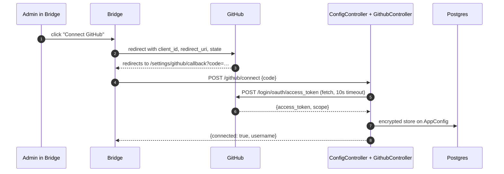
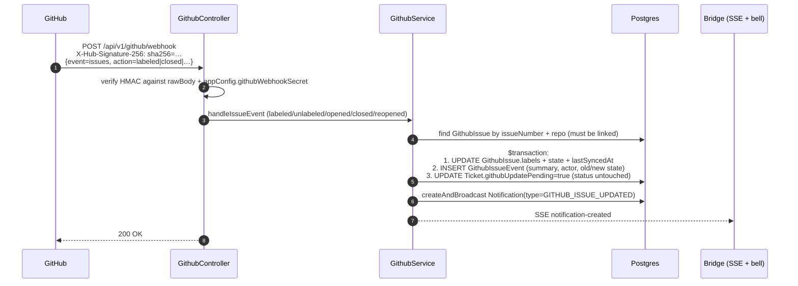
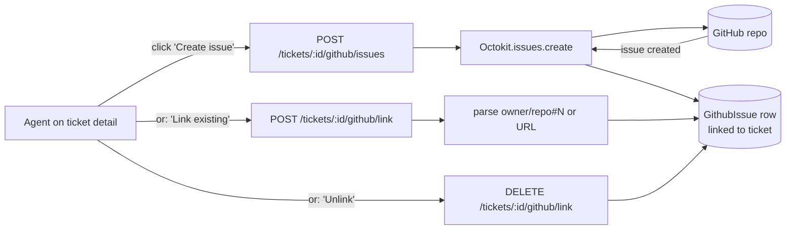

# GitHub

## What it does

Two-way connection between a ticket and a GitHub Issue:

1. **OAuth connect**: admin in Bridge clicks "Connect GitHub" → standard OAuth code-exchange flow → access token stored in `AppConfig`.
2. **Issue creation / linking**: from a ticket's GitHub panel, the agent creates a new issue in the configured default repo, or links an existing issue by URL / `owner/repo#123`.
3. **Webhook → attention flag**: GitHub fires `issues` events at our endpoint. When a developer changes a **label** or the **open/closed state** of a *linked* issue, we sync the issue's live labels + state onto the ticket, append a `GithubIssueEvent` to an activity timeline, raise a **separate attention flag** (`Ticket.githubUpdatePending`) — deliberately **without** touching the workflow `TicketStatus` — and create a `GITHUB_ISSUE_UPDATED` notification. The agent reviews the change and decides the next step; the flag clears on acknowledge or when the agent opens the ticket.

There is **no label configuration** and **no agent→GitHub label push** — a label is just a signal that surfaces the issue change to the agent, not a mapping to an automated action.

## Stack

| Layer | Library / service | Why |
|---|---|---|
| API calls | `@octokit/rest` | Official GitHub SDK, types included |
| OAuth | Native `fetch` + `AbortSignal.timeout` | No extra OAuth lib needed for the code-exchange step |
| Webhook auth | HMAC-SHA256 via Node `crypto` | Standard GitHub webhook signature verification |
| Raw body | NestJS `rawBody: true` enabled in `main.ts` | Needed so HMAC sees the exact bytes GitHub signed |
| Webhook events | Polled-style `Notification` rows | All agents see all events; no per-agent scoping |

## OAuth flow

The callback page uses a `cancelled` ref so React Strict Mode double-invocation doesn't double-exchange the code, and the fetch has a 15s wrapper timeout in addition to the 10s SDK timeout.

## Webhook flow (label / state change → attention flag)

Only **linked** issues react; events for unknown issues are a no-op 200. Unhandled `issues` actions (assigned, milestoned, edited, …) are ignored. The flag is cleared by `POST /tickets/:id/github/acknowledge` (the card's "Acknowledge" button) or automatically the next time an **agent** opens the ticket (`findById`); portal/customer reads never clear it.

## Issue creation from a ticket

A linked issue can be removed again via `DELETE /tickets/:id/github/link` (`GithubService.unlinkIssue()`). Creating or linking an issue also captures its current labels onto `GithubIssue.labels` so the ticket card renders them immediately.

## Key files

| File | Role |
|---|---|
| [`apps/api/src/modules/github/github.controller.ts`](../../apps/api/src/modules/github/github.controller.ts) | HTTP — OAuth, webhook, issue create/link/unlink, webhook secret |
| [`apps/api/src/modules/github/github.service.ts`](../../apps/api/src/modules/github/github.service.ts) | Octokit calls, webhook HMAC verify, label/state sync + event/flag/notification |
| [`apps/api/src/modules/tickets/tickets.service.ts`](../../apps/api/src/modules/tickets/tickets.service.ts) | `acknowledgeGithubUpdate`, agent-open auto-clear, ticket-detail `githubIssue.events`, portal DTO guard |
| [`apps/api/src/main.ts`](../../apps/api/src/main.ts) | `rawBody: true` enabled (required for signature verification) |
| [`apps/bridge/src/app/(dashboard)/settings/github/page.tsx`](../../apps/bridge/src/app/(dashboard)/settings/github/page.tsx) | OAuth connect UI, default repo dropdown, webhook secret panel |
| [`apps/bridge/src/app/(dashboard)/tickets/[id]/page.tsx`](../../apps/bridge/src/app/(dashboard)/tickets/[id]/page.tsx) | Linked-issue card: live labels, attention banner + Acknowledge, activity timeline, header badge |
| [`apps/bridge/src/components/dashboard/NotificationsPanel.tsx`](../../apps/bridge/src/components/dashboard/NotificationsPanel.tsx) | Type-driven slide-over notifications list (bell), opened from the rail |

## Endpoints

See `GithubController` in [_generated/api-routes.md](_generated/api-routes.md#githubcontroller).

## Data model touched

`AppConfig` (`githubWebhookSecret`, `webhookVerifiedAt`), `GithubIssue` (ticket ↔ issue link with `repo`, `issueNumber`, current `labels` JSON, `state`, `lastSyncedAt`), `GithubIssueEvent` (append-only activity timeline per issue), `Notification` (`GITHUB_ISSUE_UPDATED`; `NotificationRead` per-agent), `Ticket` (`githubUpdatePending` + `githubUpdatedAt` attention flag, plus the `GithubIssue` relation). See [_generated/erd.md](_generated/erd.md).

## Environment variables

| Var | Purpose |
|---|---|
| `GITHUB_APP_CLIENT_ID` | OAuth client id |
| `GITHUB_APP_CLIENT_SECRET` | OAuth client secret |
| `NEXT_PUBLIC_GITHUB_CLIENT_ID` | Same value, exposed to Bridge for the OAuth redirect URL |

The webhook secret lives in DB (`AppConfig.githubWebhookSecret`), not env — admins can generate/regenerate from the Settings UI.

## Notable decisions

- **rawBody at the Nest level** — required for HMAC verification because any JSON re-serialization would produce different bytes than GitHub signed.
- **Attention flag, not status** — a label/state change raises `Ticket.githubUpdatePending` (a dedicated marker), never the workflow `TicketStatus`. Analytics, the bot, and kanban all bucket on `TicketStatus`; injecting GitHub state into it would corrupt those. The agent stays in control of the real next step.
- **`GithubIssueEvent` is a table, not a JSON column** — appends stay atomic under GitHub's near-simultaneous webhook deliveries, and the timeline is ordered/queryable.
- **No label configuration / no agent→GitHub push** — deliberately dropped. The old `fixDeployedLabel` / `pendingConfirmationLabel` config and the "Mark pending confirmation" button are gone; a label is purely an inbound signal.
- **Acknowledge lives on the tickets controller** (`POST /tickets/:id/github/acknowledge`) and agent-open auto-clears the flag, because it mutates `Ticket` and rides the existing `findById` path.
- **Webhook tunnel for local dev is manual** — ngrok or Cloudflare Tunnel; set the tunnel URL as `NEXT_PUBLIC_API_URL` and into GitHub's webhook config.
- **Notifications are global** (every agent sees every event). Per-agent scoping wasn't worth the complexity for a single-tenant app.
- **OAuth callback fix** — switched from raw `https.request` (no timeout, would hang forever) to `fetch` + `AbortSignal.timeout(10s)`; the callback page also has a 15s outer timeout + `cancelled` ref to handle React Strict Mode double-invocation.

## Known gaps

- No webhook secret rotation flow with grace period — regenerating invalidates immediately.
- Issue link supports only one issue per ticket — a ticket needing multiple linked issues falls back to manual mention in messages.
- Label colours come from the webhook payload; if a label is recoloured in GitHub without any issue event, the stored colour can drift until the next event re-syncs.
