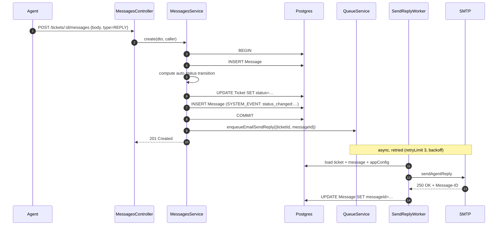
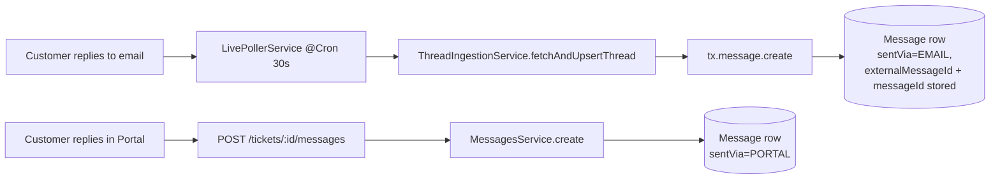

# Messages

## What it does

A message is one entry in a ticket's thread. Three kinds:

| Type | Visible to customer | When |
|---|---|---|
| `REPLY` | ✅ | Customer or agent posted to the conversation. Customer-side via portal or email; agent-side via Bridge. |
| `INTERNAL_NOTE` | ❌ | Agent-only annotation, never sent over email. |
| `SYSTEM_EVENT` | depends on UI | Status changes, GitHub link events, fix-deployed banner triggers. |

Every message persists to the same `Message` table; the differentiation is by `type` + `isInternal`.

## Stack

| Layer | Library / service | Why |
|---|---|---|
| HTTP | NestJS controller, nested under `/tickets/:id/messages` | Resource hierarchy |
| Persistence | Prisma transaction (`$transaction`) | Status transition + system event written atomically |
| Outbound email | `email:send-reply` pg-boss queue → `SendReplyWorker` → `EmailService.sendAgentReply` | Retried (3×, backoff) rather than fire-and-forget; on permanent failure writes a `email_delivery_failed:` SYSTEM_EVENT |
| Threading headers | RFC 5322 `Message-ID` returned by SMTP and stored back on the row | Enables future inbound replies to thread |

## Create flow (agent reply)

## Auto-status transition rules

Computed inside the same transaction as the message insert. Only applies when `type=REPLY` (internal notes don't change status):

| Caller | Current ticket status | Bot answered? | New status |
|---|---|---|---|
| agent | `OPEN` | — | `IN_PROGRESS` |
| agent | `IN_PROGRESS` | — | `WAITING` (awaiting customer) |
| user | `WAITING` | no | `IN_PROGRESS` |
| user | `WAITING` | **yes** | → `escalateToHuman()` sets `OPEN` + assigns on-duty agent + notifies customer |
| _anything else_ | unchanged | — | unchanged |

Every actual transition also writes a `SYSTEM_EVENT` row with `body = "status_changed:OPEN:IN_PROGRESS"` so the thread shows the history.

### Scenario 9 — customer replies after bot answer

When a customer replies on a `WAITING` ticket that has a `BotInteraction` with `didAnswer=true`, `MessagesService.create()` calls `BotService.escalateToHuman()` after the transaction (fire-and-forget with error logging). This sets ticket status to `OPEN`, assigns the on-duty agent, writes an `escalated:` SYSTEM_EVENT, and sends the customer a "a specialist will follow up" email. Guard: no re-escalation if `ticket.assigneeId` is already set.

## Customer reply paths

Both paths land in the same `Message` table with `type=REPLY`. The distinguishing field is `sentVia`. The inbound-email path bypasses `MessagesService.create` (and thus its status transitions) — that's a known gap, see below.

## Edit window

Agents can edit their own messages via `PATCH /tickets/:id/messages/:messageId` within **5 minutes** of creation. After that, edits are rejected. System events can't be edited. Customers can't edit anything.

## Key files

| File | Role |
|---|---|
| [`apps/api/src/modules/messages/messages.controller.ts`](../../apps/api/src/modules/messages/messages.controller.ts) | HTTP surface |
| [`apps/api/src/modules/messages/messages.service.ts`](../../apps/api/src/modules/messages/messages.service.ts) | Transactional create + edit + auto status transitions |
| [`apps/api/src/modules/messages/messages.dto.ts`](../../apps/api/src/modules/messages/messages.dto.ts) | Zod schemas |
| [`apps/bridge/src/app/tickets/[id]/page.tsx`](../../apps/bridge/src/app/tickets/[id]/page.tsx) | Agent reply composer + internal note tab |
| [`apps/portal/src/app/tickets/[id]/page.tsx`](../../apps/portal/src/app/tickets/[id]/page.tsx) | Customer reply composer |
| [`apps/api/src/modules/email-sync/thread-ingestion.service.ts`](../../apps/api/src/modules/email-sync/thread-ingestion.service.ts) | Inbound-email path persists messages directly (provider-agnostic ingestion) |
| [`apps/api/src/modules/email-sync/live-poller.service.ts`](../../apps/api/src/modules/email-sync/live-poller.service.ts) | `@Cron('*/30 * * * * *')` — pulls new threads from Gmail/Graph and feeds the ingestion service |

## Endpoints

See `MessagesController` in [_generated/api-routes.md](_generated/api-routes.md#messagescontroller).

## Data model touched

`Message` (`body`, `bodyRaw`, `type`, `isInternal`, `sentVia`, `authorUserId`, `authorAgentId`, `messageId`, `inReplyTo`), `Ticket` (status updates), `Attachment` (linked via `Attachment.messageId`). See [_generated/erd.md](_generated/erd.md).

## Notable decisions

- **Status transitions live in the message service**, not the ticket service — because the trigger is "a message was sent." Agents *can* still override via `PATCH /tickets/:id`.
- **`Message-ID` is persisted after-the-fact** — we generate it client-side, send to SMTP, then write it back on a second update. If the SMTP call fails the row simply has `messageId = null` and won't be used for threading. Acceptable.
- **Inbound-email replies skip `MessagesService.create`** and go through `ThreadIngestionService.fetchAndUpsertThread` (driven by `LivePollerService`'s 30s cron). They get inserted directly without status transitions. This is a known gap — see below.
- **`bodyRaw` stores the pre-strip body** for inbound emails (with quoted text). The UI displays `body` but `bodyRaw` is available for audit / "show full email" toggles.

## Attachments on reply create

`CreateMessageDto` accepts an optional `attachmentIds: string[]` field. When supplied, `MessagesService.create()` runs an `attachment.updateMany()` inside the same transaction, linking those attachment records to the new message. The `where` clause has two safety guards:

- `OR: [{ ticketId }, { ticketId: null }]` — allows freshly-uploaded files (which have `ticketId: null` before being linked) **and** files already pre-scoped to this ticket; blocks files from other tickets.
- `messageId: null` — prevents stealing an attachment already owned by another message.

The `data` block writes both `ticketId` and `messageId`, so a freshly-uploaded attachment gets fully scoped in one step.

The transaction then re-fetches the message with `include: { attachments: true }` so the response always contains the populated array. Portal and Bridge renderers read `msg.attachments` to render attachment chips.

### Portal reply composer upload flow

1. User clicks the Paperclip button in the reply toolbar → hidden `<input type="file">` opens a file picker.
2. Selected file POSTed to `POST /api/v1/files/upload` (multipart) with `Authorization: Bearer {token}`. `ticketId` is **not** passed — freshly uploaded attachments have `ticketId: null` and are scoped at message-create time via `attachmentIds`.
3. API stores bytes in MinIO, creates an `Attachment` row (`ticketId: null`, `messageId: null`), returns the row.
4. `Attachment` appended to `replyAttachments` state; a removable chip appears in the composer.
5. On send, `attachmentIds` array included in `POST /tickets/:id/messages` body.
6. `MessagesService.create()` links all attachment IDs to the new message (step above).

## Known gaps

- Inbound-email replies don't trigger the `WAITING → IN_PROGRESS` transition that portal replies do — `ThreadIngestionService` inserts directly via `tx.message.create()`. They do, however, trigger scenario-9 auto-escalation when the ticket has a bot interaction (`didAnswer=true`).
- Markdown toolbar in the portal reply composer is cosmetic — buttons don't insert markdown at cursor. Bridge composer uses `contentEditable` + `document.execCommand` (wired).
- File attach in the Bridge reply composer is not yet wired — Paperclip renders with `action: undefined`. The backend already handles `attachmentIds`; only the front-end upload + ID collection is missing (same pattern as portal).
- No typing indicators / presence between agents.
