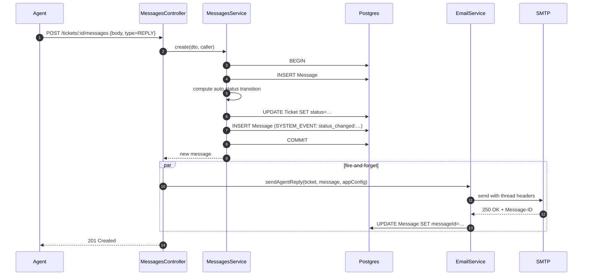
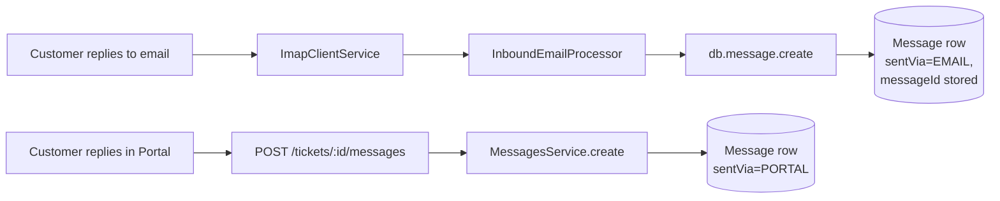

# Messages

## What it does

A message is one entry in a ticket's thread. Three kinds:

| Type | Visible to customer | When |
|---|---|---|
| `REPLY` | ✅ | Customer or agent posted to the conversation. Customer-side via portal or email; agent-side via Bridge. |
| `INTERNAL_NOTE` | ❌ | Agent-only annotation, never sent over email. |
| `SYSTEM_EVENT` | depends on UI | Status changes, GitHub link events, fix-deployed banner triggers. |

Every message persists to the same `Message` table; the differentiation is by `type` + `isInternal`.

## Stack

| Layer | Library / service | Why |
|---|---|---|
| HTTP | NestJS controller, nested under `/tickets/:id/messages` | Resource hierarchy |
| Persistence | Prisma transaction (`$transaction`) | Status transition + system event written atomically |
| Outbound email | [`EmailService.sendAgentReply`](../../apps/api/src/modules/email/email.service.ts) | Fire-and-forget after the message is persisted |
| Threading headers | RFC 5322 `Message-ID` returned by SMTP and stored back on the row | Enables future inbound replies to thread |

## Create flow (agent reply)

## Auto-status transition rules

Computed inside the same transaction as the message insert. Only applies when `type=REPLY` (internal notes don't change status):

| Caller | Current ticket status | New status |
|---|---|---|
| agent | `OPEN` | `IN_PROGRESS` |
| agent | `IN_PROGRESS` | `WAITING` (awaiting customer) |
| user | `WAITING` | `IN_PROGRESS` |
| _anything else_ | unchanged | unchanged |

Every actual transition also writes a `SYSTEM_EVENT` row with `body = "status_changed:OPEN:IN_PROGRESS"` so the thread shows the history.

## Customer reply paths

Both paths land in the same `Message` table with `type=REPLY`. The distinguishing field is `sentVia`. The inbound-email path bypasses `MessagesService.create` (and thus its status transitions) — that's a known gap, see below.

## Edit window

Agents can edit their own messages via `PATCH /tickets/:id/messages/:messageId` within **5 minutes** of creation. After that, edits are rejected. System events can't be edited. Customers can't edit anything.

## Key files

| File | Role |
|---|---|
| [`apps/api/src/modules/messages/messages.controller.ts`](../../apps/api/src/modules/messages/messages.controller.ts) | HTTP surface |
| [`apps/api/src/modules/messages/messages.service.ts`](../../apps/api/src/modules/messages/messages.service.ts) | Transactional create + edit + auto status transitions |
| [`apps/api/src/modules/messages/messages.dto.ts`](../../apps/api/src/modules/messages/messages.dto.ts) | Zod schemas |
| [`apps/bridge/src/app/tickets/[id]/page.tsx`](../../apps/bridge/src/app/tickets/[id]/page.tsx) | Agent reply composer + internal note tab |
| [`apps/portal/src/app/tickets/[id]/page.tsx`](../../apps/portal/src/app/tickets/[id]/page.tsx) | Customer reply composer |
| [`apps/api/src/modules/email/inbound.processor.ts`](../../apps/api/src/modules/email/inbound.processor.ts) | Inbound-email path persists messages directly |

## Endpoints

See `MessagesController` in [_generated/api-routes.md](_generated/api-routes.md#messagescontroller).

## Data model touched

`Message` (`body`, `bodyRaw`, `type`, `isInternal`, `sentVia`, `authorUserId`, `authorAgentId`, `messageId`, `inReplyTo`), `Ticket` (status updates), `Attachment` (linked via `Attachment.messageId`). See [_generated/erd.md](_generated/erd.md).

## Notable decisions

- **Status transitions live in the message service**, not the ticket service — because the trigger is "a message was sent." Agents *can* still override via `PATCH /tickets/:id`.
- **`Message-ID` is persisted after-the-fact** — we generate it client-side, send to SMTP, then write it back on a second update. If the SMTP call fails the row simply has `messageId = null` and won't be used for threading. Acceptable.
- **Inbound-email replies skip `MessagesService.create`** and go through `InboundEmailProcessor`. They get inserted directly without status transitions. This is a known gap — see below.
- **`bodyRaw` stores the pre-strip body** for inbound emails (with quoted text). The UI displays `body` but `bodyRaw` is available for audit / "show full email" toggles.

## Known gaps

- Inbound-email replies don't trigger the `WAITING → IN_PROGRESS` transition that portal replies do — the processor inserts directly to `db.message.create()` instead of going through `MessagesService.create()`. The fix is to refactor the processor to call the service (or vice versa: extract a `persistAndTransition` helper they both call).
- Markdown toolbar in both reply composers is cosmetic — buttons don't insert markdown at cursor yet.
- No attachments in the reply composer (portal). Inbound mail with attachments doesn't extract them either.
- No typing indicators / presence between agents.
