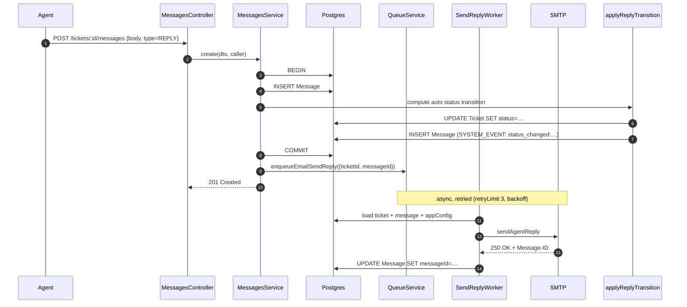
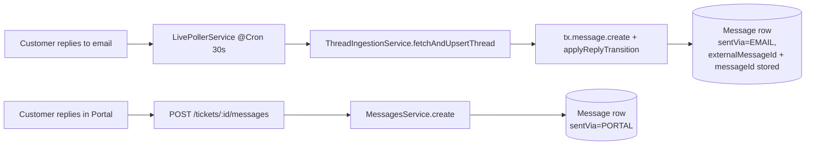

# Messages

## What it does

A message is one entry in a ticket's thread. Three kinds:

| Type | Visible to customer | When |
|---|---|---|
| `REPLY` | ✅ | Customer or agent posted to the conversation. Customer-side via portal or email; agent-side via Bridge. |
| `INTERNAL_NOTE` | ❌ | Agent-only annotation, never sent over email. |
| `SYSTEM_EVENT` | depends on UI | Status changes, GitHub link events, fix-deployed banner triggers. |

Every message persists to the same `Message` table; the differentiation is by `type` + `isInternal`.

## Stack

| Layer | Library / service | Why |
|---|---|---|
| HTTP | NestJS controller, nested under `/tickets/:id/messages` | Resource hierarchy |
| Persistence | Prisma transaction (`$transaction`) | Status transition + system event written atomically |
| Outbound email | `email:send-reply` pg-boss queue → `SendReplyWorker` → `EmailService.sendAgentReply` | Retried (3×, backoff) rather than fire-and-forget; on permanent failure writes a `email_delivery_failed:` SYSTEM_EVENT |
| Status machine | `applyReplyTransition()` (`modules/tickets/util/apply-reply-transition.ts`) | Shared utility used by both `MessagesService` (portal) and `ThreadIngestionService` (email) |
| Threading headers | RFC 5322 `Message-ID` returned by SMTP and stored back on the row | Enables future inbound replies to thread |

## Create flow (agent reply)



### Customer portal reply — email mirror (G1)

When a customer posts a `REPLY` via the portal, `MessagesService.create()` also enqueues a second job:

```
QueueService.enqueueEmailSendReply({ ticketId, messageId, kind: 'portal-copy' })
```

`SendReplyWorker` branches on `kind === 'portal-copy'` and calls `EmailService.sendPortalReplyCopy()` instead of `sendAgentReply()`. The copy is self-addressed (From/To = support address) so the inbound poller's RFC-messageId dedup silently drops it. Gated by `AppConfig.mirrorPortalRepliesToEmail` (default `true`).

## Auto-status transition rules

Computed inside `applyReplyTransition()` (shared between portal and email paths). Applies when `type=REPLY` and the ticket `isTicket=true` and not a backfill (internal notes, conversations, and backfill imports do not change status):

| Caller | Current ticket status | New status |
|---|---|---|
| agent | `OPEN` | `IN_PROGRESS` |
| agent | `IN_PROGRESS` | `WAITING` (awaiting customer) |
| customer | `WAITING` | `IN_PROGRESS` |
| customer | `RESOLVED` or `CLOSED` | `IN_PROGRESS` + `reopenCount++` |
| _anything else_ | unchanged | unchanged |

Every actual transition also writes a `SYSTEM_EVENT` row with `body = "status_changed:OPEN:IN_PROGRESS"` so the thread shows the history. The `RESOLVED`/`CLOSED` → `IN_PROGRESS` path is a reopen; both `MessagesService` and `ThreadIngestionService` use the same utility so portal and email paths are consistent.

### Scenario 9 — customer replies after bot answer

When a customer replies on a `WAITING` ticket that has a `BotInteraction` with `didAnswer=true`, `MessagesService.create()` calls `BotService.escalateToHuman()` after the transaction (fire-and-forget with error logging). This sets ticket status to `OPEN`, assigns the on-duty agent, writes an `escalated:` SYSTEM_EVENT, and sends the customer a "a specialist will follow up" email. Guard: no re-escalation if `ticket.assigneeId` is already set.

## Customer reply paths



Both paths land in the same `Message` table with `type=REPLY`. The distinguishing field is `sentVia`. Both paths now call `applyReplyTransition()` for consistent status-machine behavior (G3).

## Edit window

Agents can edit their own messages via `PATCH /tickets/:id/messages/:messageId` within **5 minutes** of creation. After that, edits are rejected. System events can't be edited. Customers can't edit anything.

## Key files

| File | Role |
|---|---|
| [`apps/api/src/modules/messages/messages.controller.ts`](../../apps/api/src/modules/messages/messages.controller.ts) | HTTP surface |
| [`apps/api/src/modules/messages/messages.service.ts`](../../apps/api/src/modules/messages/messages.service.ts) | Transactional create + edit + auto status transitions |
| [`apps/api/src/modules/messages/messages.dto.ts`](../../apps/api/src/modules/messages/messages.dto.ts) | Zod schemas |
| [`apps/bridge/src/app/tickets/[id]/page.tsx`](../../apps/bridge/src/app/tickets/[id]/page.tsx) | Agent reply composer + internal note tab |
| [`apps/portal/src/app/tickets/[id]/page.tsx`](../../apps/portal/src/app/tickets/[id]/page.tsx) | Customer reply composer |
| [`apps/api/src/modules/email-sync/thread-ingestion.service.ts`](../../apps/api/src/modules/email-sync/thread-ingestion.service.ts) | Inbound-email path persists messages directly (provider-agnostic ingestion) |
| [`apps/api/src/modules/email-sync/live-poller.service.ts`](../../apps/api/src/modules/email-sync/live-poller.service.ts) | `@Cron('*/30 * * * * *')` — pulls new threads from Gmail/Graph and feeds the ingestion service |

## Endpoints

See `MessagesController` in [_generated/api-routes.md](_generated/api-routes.md#messagescontroller).

## Data model touched

`Message` (`body`, `bodyHtml`, `bodyRaw`, `type`, `isInternal`, `sentVia`, `authorUserId`, `authorAgentId`, `messageId`, `inReplyTo`), `Ticket` (status updates), `Attachment` (linked via `Attachment.messageId`). See [_generated/erd.md](_generated/erd.md).

## Notable decisions

- **Status transitions live in the message service**, not the ticket service — because the trigger is "a message was sent." Agents *can* still override via `PATCH /tickets/:id`.
- **Shared `applyReplyTransition()` utility (G3)** — status-machine logic extracted from `MessagesService` into `apps/api/src/modules/tickets/util/apply-reply-transition.ts`. Both `MessagesService` (portal path) and `ThreadIngestionService` (email path) call this utility inside the same Prisma transaction, ensuring consistent behavior.
- **`Message-ID` is persisted after-the-fact** — we generate it client-side, send to SMTP, then write it back on a second update. If the SMTP call fails the row simply has `messageId = null` and won't be used for threading. Acceptable.
- **Inbound-email replies now drive the status machine (G3)** — `ThreadIngestionService.fetchAndUpsertThread` calls `applyReplyTransition()` per message (skipped for backfills and non-ticket conversations).
- **`bodyRaw` stores the pre-strip body** for inbound emails (with quoted text). The UI displays `body` but `bodyRaw` is available for audit / "show full email" toggles.
- **Rendering prefers `bodyHtml`** (2026-06-10). Both Bridge (`MessageCard`) and Portal render the sanitized `bodyHtml` when present so inbound email looks like it does in Gmail (signatures, tables, images); `body` (plain text) is the fallback. In Bridge, quoted reply history inside the HTML (`div.gmail_quote`, `blockquote[type=cite]`) is collapsed behind the `···` toggle via `splitQuotedHtml()` (`packages/ui/src/sanitize.ts`). The plain-text fallback's HTML detection (`isHtmlBody()`) uses a known-tag allowlist because Gmail plain text renders links as `<https://…>`, which the old any-tag regex misdetected as HTML — flattening multi-line bodies onto one line (R199).
- **GraphProvider derives `bodyPlain` via `htmlToText()`** (`email-sync/util/html-to-text.ts`) — structure-preserving conversion (block tags → newlines, entities decoded) instead of a naive tag-strip that flattened everything onto one line (R201).

## Attachments on reply create

`CreateMessageDto` accepts an optional `attachmentIds: string[]` field. When supplied, `MessagesService.create()` runs an `attachment.updateMany()` inside the same transaction, linking those attachment records to the new message. The `where` clause has two safety guards:

- `OR: [{ ticketId }, { ticketId: null }]` — allows freshly-uploaded files (which have `ticketId: null` before being linked) **and** files already pre-scoped to this ticket; blocks files from other tickets.
- `messageId: null` — prevents stealing an attachment already owned by another message.

The `data` block writes both `ticketId` and `messageId`, so a freshly-uploaded attachment gets fully scoped in one step.

The transaction then re-fetches the message with `include: { attachments: true }` so the response always contains the populated array. Portal and Bridge renderers read `msg.attachments` to render attachment chips.

### Portal reply composer upload flow

1. User clicks the Paperclip button in the reply toolbar → hidden `<input type="file">` opens a file picker.
2. Selected file POSTed to `POST /api/v1/files/upload?ticketId={id}` (multipart) with `Authorization: Bearer {token}`.
3. API stores bytes in MinIO, creates an `Attachment` row, returns the row.
4. `Attachment` appended to `replyAttachments` state; a removable chip appears in the composer.
5. On send, `attachmentIds` array included in `POST /tickets/:id/messages` body.
6. `MessagesService.create()` links all attachment IDs to the new message (step above).

### Bridge reply composer upload flow (G7)

Same pattern as the portal. The Paperclip button in the Bridge reply toolbar clicks a hidden `<input type="file">`. Selected files are uploaded to `POST /api/v1/files/upload?ticketId={id}`, returned attachment IDs are held in `replyAttachments` state, and chips appear above the toolbar with an `×` button. On send, `attachmentIds` is included in the `POST /tickets/:id/messages` payload.

## CC on agent replies (sticky participants)

### Data model

- `Message.cc String[] @default([])` — immutable snapshot of the CC list that was on the wire for that send. Rendered as `Cc: …` in the Bridge timeline under each reply header.
- `TicketParticipant` — relational table indexed `[ticketId, email]` (unique). The live CC list for the ticket. Source can be `AGENT` (added/edited by an agent reply) or `INBOUND` (auto-added when a third party replies into the thread from email).

### Add / remove flow

1. Agent opens the Reply composer — a CC chip row auto-populates from `ticket.participants`.
2. Agent adds/removes chips. On Send, the full intended list is sent as `dto.cc`.
3. `MessagesService.create()` — within the same transaction as `message.create()`:
   - Writes `cc: ccInput` onto the Message row (snapshot).
   - Reconciles `TicketParticipant`: `deleteMany` participants no longer in the list, then `createMany({ skipDuplicates: true })` for new ones with `source=AGENT`.
4. The primary customer's email is silently dropped from CC before storage (E1).
5. `dto.cc` omitted (old client) → participants untouched (E13). `dto.cc: []` → all participants cleared.

### Validation

- Zod (DTO): email format, max 20, lowercase+trim+dedup.
- Service: CC only allowed on agent REPLY (not INTERNAL_NOTE, not user-role callers).

### Inbound auto-add

When `ThreadIngestionService` processes a message whose `from:` address is not the ticket's primary customer and not a known alias/agent, it upserts a `TicketParticipant` with `source=INBOUND`. The sender is also attributed their own `User` row (per-message attribution) rather than the thread-level customer.

## Known gaps

- Markdown toolbar in the portal reply composer is cosmetic — buttons don't insert markdown at cursor. Bridge composer uses `contentEditable` + `document.execCommand` (wired).
- No typing indicators / presence between agents.
