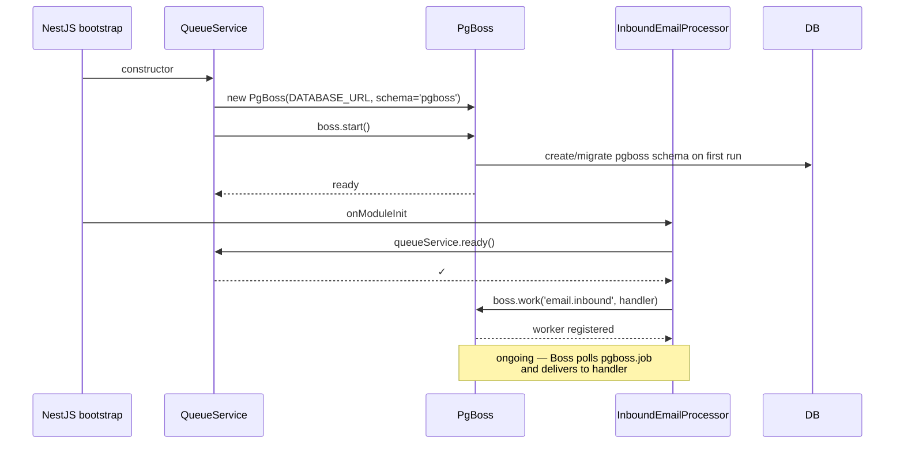

# Queue

## What it does

Background job processing. Today there's exactly one queue — `email.inbound` — used by [email.md](email.md) to decouple IMAP fetch from message persistence. The infrastructure is general-purpose and ready to host more queues as needed.

## Why pg-boss (not BullMQ/Redis)

Removed BullMQ + Redis in Session 16. Tradeoffs:

| | BullMQ + Redis | pg-boss (current) |
|---|---|---|
| Throughput | 10k+ jobs/s | 1–3k jobs/s |
| Latency to pick up | ~1 ms | ~50–200 ms |
| Backing store | Redis (extra service) | Postgres `pgboss` schema |
| Backups | Two systems | One (Postgres) |
| Deployment footprint | API + Postgres + Redis | API + Postgres |

For support volumes (hundreds of jobs/day on the high end) the latency difference is invisible; the deployment simplification is enormous.

**Pinned to v9** specifically — pg-boss v10+ is ESM-only and breaks our CommonJS NestJS build. The v9 API surface we use (`send`, `work`, `start`, `stop`) is identical for our purposes.

## Lifecycle



## Enqueue API (used by IMAP)

```ts
await queueService.enqueueInbound({ uid, rawMime, receivedAt })
// → boss.send('email.inbound', data, {
//     retryLimit: 5,
//     retryDelay: 5,            // seconds
//     retryBackoff: true,       // exponential
//     expireInHours: 24,
//   })
```

A job that throws is retried up to 5 times with exponential backoff (5 s, ~10 s, ~20 s, ~40 s, ~80 s). After exhaustion the job moves to a failed state in `pgboss.job` and stays there for the configured archive period.

## Key files

| File | Role |
|---|---|
| [`apps/api/src/modules/queue/queue.module.ts`](../../apps/api/src/modules/queue/queue.module.ts) | `@Global()` module, exports `QueueService` |
| [`apps/api/src/modules/queue/queue.service.ts`](../../apps/api/src/modules/queue/queue.service.ts) | Owns the `PgBoss` instance, manages lifecycle, exposes `enqueueInbound` + `getBoss` + `ready` |
| [`apps/api/src/modules/email/inbound.processor.ts`](../../apps/api/src/modules/email/inbound.processor.ts) | Registers the worker for `email.inbound` |

## Endpoints

None — the queue isn't exposed over HTTP. Inspect via SQL: `SELECT * FROM pgboss.job ORDER BY createdon DESC LIMIT 20;`

## Notable decisions

- **Same `DATABASE_URL` connection** — no separate connection config to maintain. The `pgboss` schema is auto-created on first boot; no manual migration.
- **`@Global()` module** so any future service can inject `QueueService` without re-importing it.
- **Worker registration deferred** to `onModuleInit` so dependencies (PrismaService, AppConfigService, EmailRoutingService) are already wired before the first job can fire.

## Known gaps

- Only one queue right now. Future candidates: outbound email send (currently inline + fire-and-forget), GitHub webhook delivery, analytics aggregation.
- No admin UI for queue introspection (would be useful to see retries / failures without dropping into SQL).
