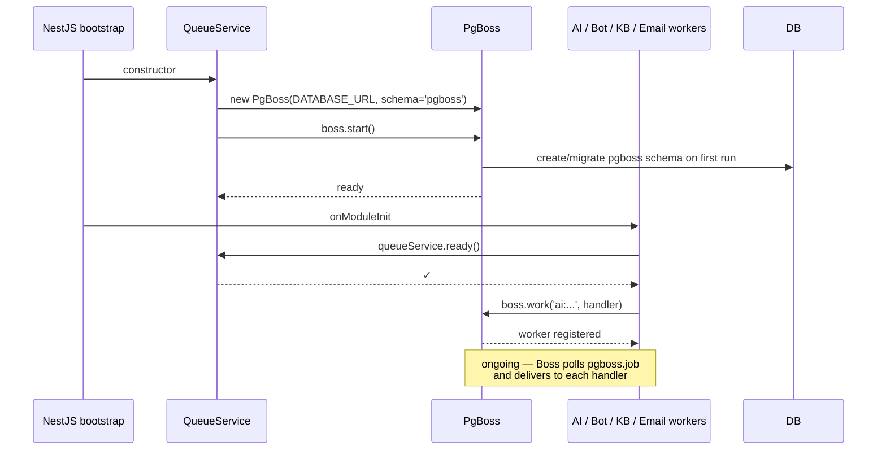

# Queue

## What it does

Background job processing. There are **ten queues** across four owner modules ([AI](ai.md), [Bot](bot.md), [Knowledge base](bot.md), [Email](email.md)) — used to keep slow Gemini calls, bot responses, KB crawling/embedding, and outbound email off the request path. The infrastructure is general-purpose; new queues are added by exporting a constant from `queue.module.ts`, an `enqueue*` method on `QueueService`, and registering a worker via `QueueService.getBoss().work(...)`.

| Queue | Producer | Worker | Purpose |
|---|---|---|---|
| `ai:analyze-message` | `MessagesService.create()` on customer REPLY · `ThreadIngestionService` (live email) · `TicketsService.create()` (description message) | `AnalyzeMessageWorker` | Sentiment + churn / advocacy signal detection |
| `ai:classify-ticket` | `TicketsService.update()` on → RESOLVED | `ClassifyTicketWorker` | Topic upsert + CSAT score + effort score + summary |
| `ai:request-csat` | `TicketsService.update()` on → RESOLVED | `RequestCsatWorker` | Sends CSAT rating email (30 min delay) |
| `bot:respond-to-ticket` | `TicketsService.create()` on new ticket | `RespondToNewTicketWorker` (bot module) | Athena first-responder RAG answer / escalation |
| `kb:crawl-and-index` | `POST /kb/crawl/start` | `CrawlAndIndexWorker` | Full crawl + index of the knowledge-base root URL |
| `kb:scan` | `POST /kb/scan/start` | `CrawlAndIndexWorker` | Phase 1 of two-phase indexing: scan + chunk count |
| `kb:embed` | `POST /kb/embed/confirm` | `CrawlAndIndexWorker` | Phase 2: embed confirmed chunks (pgvector) |
| `kb:index-page` | `POST /kb/sources/:id/reindex` | `CrawlAndIndexWorker` | Re-index a single source/page |
| `email:send-reply` | `MessagesService.create()` on agent REPLY; also for `kind:'portal-copy'` customer portal replies (G1) | `SendReplyWorker` (email module) | Outbound email delivery (Gmail/Graph/SMTP) with retry; branches on `kind` field |
| `email:send-confirmation` | `TicketsService.activateTicket()` on portal ticket create or convert | `SendConfirmationWorker` (email module) | Sends ticket confirmation email with 3× retry; writes `confirmation_sent:` SYSTEM_EVENT on success (G2) |

Email ingestion does **not** use a queue — `LivePollerService` calls `ThreadIngestionService.fetchAndUpsertThread()` synchronously from its `@Cron('*/30 * * * * *')` tick. See [email.md](email.md).

## Why pg-boss (not BullMQ/Redis)

Removed BullMQ + Redis in Session 16. Tradeoffs:

| | BullMQ + Redis | pg-boss (current) |
|---|---|---|
| Throughput | 10k+ jobs/s | 1–3k jobs/s |
| Latency to pick up | ~1 ms | ~50–200 ms |
| Backing store | Redis (extra service) | Postgres `pgboss` schema |
| Backups | Two systems | One (Postgres) |
| Deployment footprint | API + Postgres + Redis | API + Postgres |

For support volumes (hundreds of jobs/day on the high end) the latency difference is invisible; the deployment simplification is enormous.

**Pinned to v9** specifically — pg-boss v10+ is ESM-only and breaks our CommonJS NestJS build. The v9 API surface we use (`send`, `work`, `start`, `stop`) is identical for our purposes.

## Lifecycle



## Enqueue API

```ts
// Sentiment analysis on a new customer REPLY
await queueService.enqueueAnalyzeMessage({ messageId, ticketId })
// → boss.send('ai:analyze-message', data, { retryLimit: 3, retryDelay: 10, retryBackoff: true })

// Ticket reached RESOLVED — classify topic, score CSAT + effort
await queueService.enqueueClassifyTicket({ ticketId })
// → boss.send('ai:classify-ticket', data, { retryLimit: 3, retryDelay: 30, retryBackoff: true })

// Send the CSAT rating email — 30 min after RESOLVED so the customer isn't pinged immediately
await queueService.enqueueRequestCsat({ ticketId }, /* delaySec */ 1800)
// → boss.send('ai:request-csat', data, { startAfter: 1800, retryLimit: 2 })
```

The bot / KB / email queues follow the same pattern (`enqueueBotRespond`, `enqueueKbCrawl`, `enqueueKbScan`, `enqueueKbEmbed`, `enqueueKbIndexPage`, `enqueueEmailSendReply`).

Retry behaviour summary:

| Queue | `retryLimit` | `retryDelay` | `startAfter` | `retryBackoff` |
|---|---|---|---|---|
| `ai:analyze-message` | 3 | 10 s | — | exponential |
| `ai:classify-ticket` | 3 | 30 s | — | exponential |
| `ai:request-csat` | 2 | — | 30 min | none (linear retry) |
| `bot:respond-to-ticket` | 3 | 30 s | — | exponential |
| `kb:crawl-and-index` | 1 | — | — | — |
| `kb:scan` | 1 | — | — | — |
| `kb:embed` | 1 | — | — | — |
| `kb:index-page` | 3 | 60 s | — | exponential |
| `email:send-reply` | 3 | 30 s | — | exponential |
| `email:send-confirmation` | 3 | 30 s | — | exponential |

After exhaustion the job moves to a failed state in `pgboss.job` and stays there for the configured archive period.

## Key files

| File | Role |
|---|---|
| [`apps/api/src/modules/queue/queue.module.ts`](../../apps/api/src/modules/queue/queue.module.ts) | `@Global()` module, exports `QueueService` |
| [`apps/api/src/modules/queue/queue.service.ts`](../../apps/api/src/modules/queue/queue.service.ts) | Owns the `PgBoss` instance, manages lifecycle, exposes `enqueueAnalyzeMessage`, `enqueueClassifyTicket`, `enqueueRequestCsat`, `getBoss`, `ready` |
| [`apps/api/src/modules/ai/workers/analyze-message.worker.ts`](../../apps/api/src/modules/ai/workers/analyze-message.worker.ts) | Registers the worker for `ai:analyze-message` |
| [`apps/api/src/modules/ai/workers/classify-ticket.worker.ts`](../../apps/api/src/modules/ai/workers/classify-ticket.worker.ts) | Registers the worker for `ai:classify-ticket` |
| [`apps/api/src/modules/ai/workers/request-csat.worker.ts`](../../apps/api/src/modules/ai/workers/request-csat.worker.ts) | Registers the worker for `ai:request-csat` |
| [`apps/api/src/modules/bot/workers/respond-to-new-ticket.worker.ts`](../../apps/api/src/modules/bot/workers/respond-to-new-ticket.worker.ts) | Registers the worker for `bot:respond-to-ticket` |
| [`apps/api/src/modules/knowledge-base/workers/crawl-and-index.worker.ts`](../../apps/api/src/modules/knowledge-base/workers/crawl-and-index.worker.ts) | Registers the workers for all four `kb:*` queues |
| [`apps/api/src/modules/email/workers/send-reply.worker.ts`](../../apps/api/src/modules/email/workers/send-reply.worker.ts) | Registers the worker for `email:send-reply` |

## Endpoints

None — the queues aren't exposed over HTTP. Inspect via SQL: `SELECT * FROM pgboss.job ORDER BY createdon DESC LIMIT 20;`

## Notable decisions

- **Same `DATABASE_URL` connection** — no separate connection config to maintain. The `pgboss` schema is auto-created on first boot; no manual migration.
- **`@Global()` module** so any service can inject `QueueService` without re-importing it.
- **Worker registration deferred** to `onModuleInit` so dependencies (PrismaService, AppConfigService, GeminiService) are already wired before the first job can fire.
- **No queue for inbound email** — `ThreadIngestionService` is called synchronously by `LivePollerService` (the 30 s cron). The queue is reserved for genuinely deferrable work (AI calls + CSAT emails).
- **CSAT uses `startAfter`, not a custom scheduler** — pg-boss schedules the job 30 minutes into the future natively. No separate Bull scheduler / cron job.

## Known gaps

- No admin UI for queue introspection (would be useful to see retries / failures without dropping into SQL).
- No dead-letter handling beyond pg-boss's built-in archive. A job that exhausts retries logs and stops; we don't notify anyone (except `email:send-reply`, whose worker posts an `email_delivery_failed` system event on final failure).
