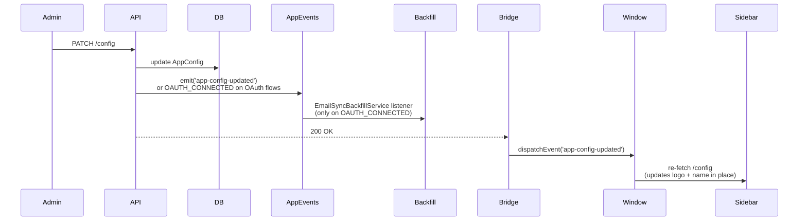

# Settings

## What it does

Admin-only configuration UI in Bridge under `/settings`. Edits a single `AppConfig` row in the database — there's only ever one. Covers:

- **General**: app name, app icon (base64-encoded PNG/SVG), theme toggle (dark default)
- **Branding**: primary + accent colors, logo upload (separate from icon), brand-color extraction from image or website URL
- **Agents**: invite, list, change role, activate / deactivate. Also holds the **AI First-Responder fallback agent** — the agent who receives tickets when Athena cannot answer and no shift is active.
- **GitHub**: see [github.md](github.md)
- **Email**: see [email.md](email.md)
- **AI Assistant**: Gemini provider/key, chat model, knowledge base crawl. See [ai.md](ai.md).
- **AI Usage & Cost**: Gemini API consumption by day and operation — admin-only

## Live update mechanism

When a save happens, the API emits an `app-config-updated` event on the global `AppEventsService`. Sidebars and providers in Bridge listen for `window.dispatchEvent('app-config-updated')` and refresh in place — no reload needed.

## Key files

| File | Role |
|---|---|
| [`apps/api/src/modules/config/config.controller.ts`](../../apps/api/src/modules/config/config.controller.ts) | All `/config/*` endpoints |
| [`apps/api/src/modules/config/config.service.ts`](../../apps/api/src/modules/config/config.service.ts) | CRUD, `getSafe()` (redacts passwords), `extractBrand` (color extraction from URL or image) |
| [`apps/api/src/common/events/app-events.service.ts`](../../apps/api/src/common/events/app-events.service.ts) | Node `EventEmitter` wrapper exposed as `@Global()` Nest service |
| [`apps/bridge/src/app/settings/layout.tsx`](../../apps/bridge/src/app/settings/layout.tsx) | Settings shell + live "Connected" badges for GitHub and Email |
| [`apps/bridge/src/app/settings/general/page.tsx`](../../apps/bridge/src/app/settings/general/page.tsx) | App identity + theme |
| [`apps/bridge/src/app/settings/branding/page.tsx`](../../apps/bridge/src/app/settings/branding/page.tsx) | Colors + logo + brand extraction |
| [`apps/bridge/src/app/settings/agents/page.tsx`](../../apps/bridge/src/app/settings/agents/page.tsx) | Agent management |
| [`apps/bridge/src/app/settings/email/page.tsx`](../../apps/bridge/src/app/settings/email/page.tsx) | Email connection (OAuth only — Google or Microsoft) |
| [`apps/bridge/src/app/settings/github/page.tsx`](../../apps/bridge/src/app/settings/github/page.tsx) | GitHub OAuth + webhook |
| [`apps/api/src/modules/config/ai-usage.controller.ts`](../../apps/api/src/modules/config/ai-usage.controller.ts) | `GET /settings/ai-usage` — admin-only AI cost metrics |
| [`apps/bridge/src/app/settings/ai-usage/page.tsx`](../../apps/bridge/src/app/settings/ai-usage/page.tsx) | AI usage dashboard page |

## Endpoints

See `ConfigController` in [_generated/api-routes.md](_generated/api-routes.md#configcontroller).

## Notable decisions

- **Single `AppConfig` row** instead of multi-tenant `Org` table. Always queried via `findFirst()`; created on demand if missing.
- **Logo stored as base64 data URI**, not as a MinIO path — simpler and the size is tiny.
- **Live config updates** via DOM event (Bridge side) + Nest `AppEventsService` (API side) — so theme / branding / OAuth-connect changes propagate without page reload or process restart. `OAUTH_CONNECTED` is consumed by `EmailSyncBackfillService` to auto-trigger backfill on first connect.
- **Brand-color extraction** has two modes: client-side canvas (drop an image, extract top 5 non-neutral colors) and server-side URL fetch (`GET /config/extract-brand?url=…` parses `meta theme-color`, CSS custom properties, and common inline-style colors).

## Portal auth page customization

Operators can choose between two layouts for the customer sign-in page, set in Bridge → Settings → Branding → **Portal auth page** card.

### Layouts

| Layout | Behaviour |
|---|---|
| **MINIMAL** (default) | Single-column centered layout. Logo (56 px, falls back to LifeBuoy icon) + `appName` above a max-440 px form card. Background uses `primaryColor` at 5 % opacity. Zero copy required — works out of the box. |
| **BRANDED** | Split 55/45 left/right layout. Left panel (dark `#0D1117`) shows `portalHeroHeadline`, optional `portalHeroSubheadline`, and a feature checklist (`portalFeatures`). Right panel holds the auth form. |

### AppConfig fields

| Field | Type | Constraint |
|---|---|---|
| `portalAuthLayout` | `AuthLayout` enum | `MINIMAL` \| `BRANDED`; default `MINIMAL` |
| `portalHeroHeadline` | `String?` | max 80 chars; **required** when layout is `BRANDED` |
| `portalHeroSubheadline` | `String?` | max 200 chars; optional |
| `portalFeatures` | `String[]` | max 5 items; **at least 1 non-empty** required when layout is `BRANDED` |

### Validation rules

- **Client-side**: Save button is disabled (with native `title` tooltip) when `portalAuthLayout === 'BRANDED'` and either `portalHeroHeadline` is blank or all feature items are blank. BRANDED fields persist across layout toggles — switching back from MINIMAL does not clear them.
- **Server-side**: `updateAppConfigSchema` in `config.service.ts` uses `.superRefine()` to enforce the same rules. A raw `PATCH /config` with `{"portalAuthLayout":"BRANDED"}` and no headline/features returns 400.

### Live preview

`AuthPagePreview` component (`apps/bridge/src/components/settings/branding/AuthPagePreview.tsx`) renders a miniature mockup of the auth page in the right column of the branding page. It reads unsaved `form` state directly — no API call. Switches between MINIMAL and BRANDED in real time. Also reflects `primaryColor`, `accentColor`, and `logoUrl` live.

"Open full preview ↗" link in the card footer opens `/auth` in a new tab (reads saved config, not live form state).

## Known gaps

- No "config history" / rollback.
- The branding palette doesn't persist arbitrary semantic colors (success/danger/warning are baked into the design tokens).
