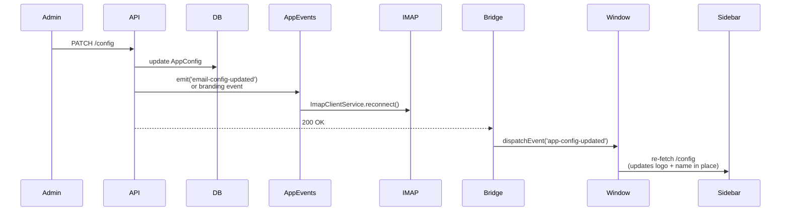

# Settings

## What it does

Admin-only configuration UI in Bridge under `/settings`. Edits a single `AppConfig` row in the database — there's only ever one. Covers:

- **General**: app name, app icon (base64-encoded PNG/SVG), theme toggle (dark default)
- **Branding**: primary + accent colors, logo upload (separate from icon), brand-color extraction from image or website URL
- **Agents**: invite, list, change role, activate / deactivate
- **GitHub**: see [github.md](github.md)
- **Email**: see [email.md](email.md)
- **AI Usage & Cost**: Gemini API consumption by day and operation — admin-only

## Live update mechanism

When a save happens, the API emits an `app-config-updated` event on the global `AppEventsService`. Sidebars and providers in Bridge listen for `window.dispatchEvent('app-config-updated')` and refresh in place — no reload needed.

## Key files

| File | Role |
|---|---|
| [`apps/api/src/modules/config/config.controller.ts`](../../apps/api/src/modules/config/config.controller.ts) | All `/config/*` endpoints |
| [`apps/api/src/modules/config/config.service.ts`](../../apps/api/src/modules/config/config.service.ts) | CRUD, `getSafe()` (redacts passwords), `extractBrand` (color extraction from URL or image) |
| [`apps/api/src/common/events/app-events.service.ts`](../../apps/api/src/common/events/app-events.service.ts) | Node `EventEmitter` wrapper exposed as `@Global()` Nest service |
| [`apps/bridge/src/app/settings/layout.tsx`](../../apps/bridge/src/app/settings/layout.tsx) | Settings shell + live "Connected" badges for GitHub and Email |
| [`apps/bridge/src/app/settings/general/page.tsx`](../../apps/bridge/src/app/settings/general/page.tsx) | App identity + theme |
| [`apps/bridge/src/app/settings/branding/page.tsx`](../../apps/bridge/src/app/settings/branding/page.tsx) | Colors + logo + brand extraction |
| [`apps/bridge/src/app/settings/agents/page.tsx`](../../apps/bridge/src/app/settings/agents/page.tsx) | Agent management |
| [`apps/bridge/src/app/settings/email/page.tsx`](../../apps/bridge/src/app/settings/email/page.tsx) | Email connection (email + app password only) |
| [`apps/bridge/src/app/settings/github/page.tsx`](../../apps/bridge/src/app/settings/github/page.tsx) | GitHub OAuth + webhook |
| [`apps/api/src/modules/config/ai-usage.controller.ts`](../../apps/api/src/modules/config/ai-usage.controller.ts) | `GET /settings/ai-usage` — admin-only AI cost metrics |
| [`apps/bridge/src/app/settings/ai-usage/page.tsx`](../../apps/bridge/src/app/settings/ai-usage/page.tsx) | AI usage dashboard page |

## Endpoints

See `ConfigController` in [_generated/api-routes.md](_generated/api-routes.md#configcontroller).

## Notable decisions

- **Single `AppConfig` row** instead of multi-tenant `Org` table. Always queried via `findFirst()`; created on demand if missing.
- **Logo stored as base64 data URI**, not as a MinIO path — simpler and the size is tiny.
- **Live config updates** via DOM event (Bridge side) + Nest `AppEventsService` (API side) — so theme / branding / IMAP creds changes propagate without page reload or process restart.
- **Brand-color extraction** has two modes: client-side canvas (drop an image, extract top 5 non-neutral colors) and server-side URL fetch (`GET /config/extract-brand?url=…` parses `meta theme-color`, CSS custom properties, and common inline-style colors).

## Known gaps

- No "config history" / rollback.
- The branding palette doesn't persist arbitrary semantic colors (success/danger/warning are baked into the design tokens).
