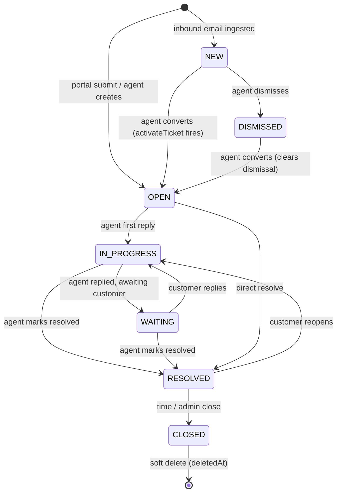
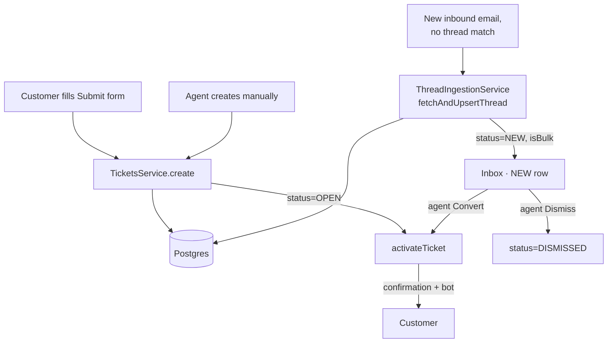

# Tickets

## What it does

The central object of the platform. A ticket represents one customer support conversation — created from the portal form, from an inbound email, or (occasionally) directly by an agent. It carries status, priority, category, optional assigned agent, and a thread of `Message` rows.

## Stack

| Layer | Library / service | Why |
|---|---|---|
| HTTP | NestJS controller + Zod validation | Same pattern as the rest of the API |
| Persistence | Prisma + Postgres | Single source of truth |
| Statuses | Enum in `schema.prisma` | `NEW · OPEN · IN_PROGRESS · WAITING · RESOLVED · CLOSED · DISMISSED` |
| Soft-delete | `deletedAt` timestamp | Archive instead of hard-delete |
| Ticket ref | `ref String @unique` — 7-char Crockford base32 | Opaque unique code; never null; replaces old `number` autoincrement |
| `isTicket` flag | `Boolean @default(false)` | `false` = conversation awaiting triage; `true` = real ticket (convert has fired) |

## Lifecycle

Auto-status transitions are wired in [`MessagesService.create`](../../apps/api/src/modules/messages/messages.service.ts) — see the messages atlas for the exact rules.

## Conversation vs ticket — `isTicket` invariant

Every `Ticket` row gets a `ref` at creation (7-char Crockford base32, unique, never null). The invariant:

| `isTicket` | Meaning |
|---|---|
| `false` | **Conversation** — inbound email awaiting triage; `ref` exists in DB but **not rendered in UI** |
| `true` | **Real ticket** — `activateTicket()` has fired; `ref` badge shown |

- Portal creates: `isTicket = true` immediately.
- Email ingest: `isTicket = false`, `status = NEW`. Convert → sets `isTicket = true` + `status = OPEN` + fires `activateTicket()`. `ref` is never regenerated on convert.
- Idempotent convert: if `isTicket` is already `true`, no-op.

## Status model — NEW and DISMISSED

Inbound-email rows land in `NEW` (conversation, not yet a real ticket). Portal rows are `OPEN` immediately.

| Status | Meaning |
|---|---|
| `NEW` | Inbound email awaiting agent triage — not visible to customer, no auto-reply |
| `OPEN` | Real ticket; confirmation + bot have fired |
| `IN_PROGRESS` | Agent replied; waiting on customer |
| `WAITING` | Customer replied; waiting on agent |
| `RESOLVED` | Resolved by agent |
| `CLOSED` | Permanently closed |
| `DISMISSED` | Agent marked as spam/irrelevant; `dismissedAt` + `dismissedById` stamped |

**Rules**:
- Portal tickets → `isTicket=true`, `OPEN` immediately; `activateTicket()` fires confirmation + bot.
- Inbound emails → `isTicket=false`, `NEW`; `isBulk = true` if bulk signals detected. No confirmation or bot.
- Agent clicks **Convert to ticket** (sidebar on detail page) → `isTicket=true`, `status=OPEN`; `activateTicket()` fires.
- Agent clicks **Dismiss** (sidebar) → `status=DISMISSED`; no customer email. Only `NEW` conversations can be dismissed.
- Default `GET /tickets` (portal, stats) excludes `DISMISSED`. Agent default sees everything except DISMISSED (conversations + tickets).
- `isBulk = true` still stored on `Ticket` but no longer drives UI — `User.category=PROMOTIONAL` is the new user-level signal.

## Creation paths

Two ticket-creation funnels: `TicketsService.create()` is invoked for portal submissions (status `OPEN`). Inbound emails are created inside `ThreadIngestionService.fetchAndUpsertThread()` with `status = NEW` — no auto-flow fires until an agent converts the ticket. Both funnels share the same `Ticket` model and lifecycle.

`TicketsService.activateTicket(ticketId)` is the single method that sends the confirmation email and enqueues the bot. It is called from exactly two places: `create()` (portal) and `convert()` (inbound email).

## List + filter + search

The unified Inbox and Portal use the same `GET /tickets` endpoint with query params (no `view` param anymore):

- `status` — single value from `TicketStatus`; optional passthrough filter
- `isTicket` — `true` | `false`; optional passthrough filter
- `category` — same
- `assigneeId` — literal agent id
- `search` — case-insensitive against title, customer email/name, `field2`
- `limit` / `offset` — pagination
- `sortOrder` — `desc` / `asc` on `updatedAt` (default) or `createdAt`

Agent default: returns all non-deleted non-DISMISSED rows (conversations + tickets). Portal callers (`role=user`) always get own `isTicket=true` rows only; portal must not deep-link to pre-triage conversations (returns 404).

Stats (`GET /tickets/stats`): `newCount` = conversations with `isTicket=false, status=NEW` (drives Inbox badge). Stats only count real tickets (`isTicket=true`) for `byStatus`/`byCategory`/`unassigned`.

## Customers page — `GET /users`

New agent-only endpoint: `GET /users?limit&offset&search&category` returns paginated customers with aggregates:

- `ticketCount` — real tickets (`isTicket=true`)
- `conversationCount` — conversations (`isTicket=false`, not DISMISSED)
- `openCount` — rows with `status IN (OPEN, IN_PROGRESS, WAITING)`
- `domain` — `split_part(email,'@',2)` from Postgres

`PATCH /users/:id { category }` — agent updates `User.category` (CUSTOMER/MARKETING/PROMOTIONAL).

`GET /users/:id` returns the customer profile: user info, stats (`totalTickets`/`openTickets`, tickets only), `notes`, and `recentTickets` — the user's **conversations *and* tickets** (`status != DISMISSED`, newest first, up to 50). Each row carries `isTicket`/`status`; the Bridge `CustomerProfilePanel` renders them under "Conversations & Tickets", shows the `ref` only when `isTicket`, and each row is clickable → `/tickets/:id`.

## Key files

| File | Role |
|---|---|
| [`apps/api/src/modules/tickets/tickets.controller.ts`](../../apps/api/src/modules/tickets/tickets.controller.ts) | HTTP surface |
| [`apps/api/src/modules/tickets/tickets.service.ts`](../../apps/api/src/modules/tickets/tickets.service.ts) | Create / list / search / stats / status transitions / soft-delete |
| [`apps/api/src/modules/tickets/tickets.dto.ts`](../../apps/api/src/modules/tickets/tickets.dto.ts) | Zod schemas for create / update / list |
| [`apps/portal/src/app/submit/page.tsx`](../../apps/portal/src/app/submit/page.tsx) | Customer Submit form |
| [`apps/bridge/src/app/inbox/page.tsx`](../../apps/bridge/src/app/inbox/page.tsx) | Unified Inbox — **Domain → conversations** (2-level, sender shown inline per row); no tab strip; Convert/Dismiss in ticket detail sidebar |
| [`apps/bridge/src/app/customers/page.tsx`](../../apps/bridge/src/app/customers/page.tsx) | Customers page — table of users with aggregates; inline `UserCategoryControl` |
| [`apps/bridge/src/app/tickets/domain/[domain]/page.tsx`](../../apps/bridge/src/app/tickets/domain/[domain]/page.tsx) | Per-domain view — hero header with favicon + name, flat ticket list, status filter, "← Inbox" back button |
| [`apps/bridge/src/app/tickets/[id]/page.tsx`](../../apps/bridge/src/app/tickets/[id]/page.tsx) | Ticket detail — Gmail-thread layout; inline compose; AI Analysis in sidebar |
| [`apps/bridge/src/lib/useEmailConfig.ts`](../../apps/bridge/src/lib/useEmailConfig.ts) | Hook: `GET /config` → `{ isConnected, isLoading, refresh }` — module-level cache |
| [`apps/bridge/src/components/dashboard/EmailNotConfiguredGate.tsx`](../../apps/bridge/src/components/dashboard/EmailNotConfiguredGate.tsx) | Full-page gate; ADMIN sees Connect CTA → `/settings/email`; non-ADMIN sees "ask admin" state |
| [`apps/bridge/src/lib/groupTicketsByDomain.ts`](../../apps/bridge/src/lib/groupTicketsByDomain.ts) | `buildDomainGroups` — flat domain→recency-sorted tickets[] with new/open counts (inbox filters out DISMISSED before calling) |
| [`apps/api/src/modules/tickets/util/generate-ref.ts`](../../apps/api/src/modules/tickets/util/generate-ref.ts) | Crockford base32 ref generator with P2002 retry |
| [`apps/bridge/src/components/dashboard/MessageCard.tsx`](../../apps/bridge/src/components/dashboard/MessageCard.tsx) | Email-card renderer (Bridge only) — handles REPLY / INTERNAL_NOTE / SYSTEM_EVENT |

## Endpoints

See `TicketsController` in [_generated/api-routes.md](_generated/api-routes.md#ticketscontroller).

## Data model touched

`Ticket` (the row itself), `Message` (thread), `Attachment` (linked at create-time), `User` (customer), `Agent` (assignee), `Notification` (fix-deployed flag). See [_generated/erd.md](_generated/erd.md).

Key enums: `TicketStatus` · `TicketPriority` · `TicketCategory` · `TicketSource` · `UserCategory`.

## Bridge UI — Inbox page (`/inbox`)

Single unified Inbox. No tab strip. One `GET /tickets` call returns conversations + tickets, excluding DISMISSED.

**2-level grouping** (Domain → conversations, sender shown inline):
- **Domain card**: favicon, domain name, conversation count, new/open counts, last activity, expand/collapse chevron. Click left zone → `/tickets/domain/[domain]`. Single `expandedDomains` set persisted in localStorage; `PREVIEW_COUNT=5` "show more" applies to conversations.
- **Conversation row** (two-line, sender inline, clustered by consecutive sender): avatar + sender name + `UserCategoryBadge` *only for PROMOTIONAL/MARKETING* on line 1; unread dot + title (bold when new) + CategoryPill + `ref` code badge *only when `isTicket`* on line 2. Right side collapses empty slots — status pill *only for real tickets*, assignee avatar *only when assigned*, timestamp. No "Conversation" pill, no dashed assignee placeholder.

**Convert / Dismiss** moved from inline inbox buttons to the **ticket detail right sidebar** (`/tickets/[id]`). When `!isTicket`: sidebar shows "Convert to ticket" (green) + "Dismiss" buttons; hides status/priority until converted.

Header layout (left → right):
- **Title**: "Inbox" or "Tickets" (tracks active tab) + total count
- **Search** — 180 px input with debounce (300 ms), clears on Esc or × button; updates `?search=` URL param
- **Status filter** — dropdown; "All statuses" or any single `TicketStatus`
- **Category filter** — dropdown; "All categories" or any single `TicketCategory`
- **Clear** — appears only when any filter is active
- **Tab strip** (below the header row): Inbox | Tickets — `?view=` param; preserves other active filters

All filters compose — all active params are preserved when changing any one filter or tab.

## Bridge UI — domain group cards (`/inbox`)

The Inbox page (`/inbox`) groups ticket rows by customer email domain using `buildDomainGroups()`. Key design details:

- **Default state: all collapsed.** Expand state tracked as a Set; persisted in `localStorage` under `bridge.tickets.expandedDomains`. **Auto-expand exception**: on initial load of the Inbox view (`?view=inbox`), any domain that has at least one `NEW` ticket is auto-expanded, and the top domain (most recently active) is always expanded, so new mail is visible without manual interaction.
- **Two-zone group header**: clicking the left zone (favicon + domain name + counts) navigates to `/tickets/domain/[domain]`; the right chevron button expands/collapses the row list inline.
- **Group header content**: Google favicon with abbr fallback, domain name, ticket count chip, **new count chip** (red, only if `newCount > 0`), open count chip (blue, only if `openCount > 0`), last-activity timestamp, chevron button.
- **`buildDomainGroups()`** (`apps/bridge/src/lib/groupTicketsByDomain.ts`) returns `DomainGroup<T>` with `newCount` (tickets with `status === 'NEW'`) and `openCount` (OPEN / IN_PROGRESS / WAITING). Groups sorted by `lastActivity` = `max(updatedAt)` across all statuses — a domain with fresh NEW mail always floats to the top.
- **Infinite scroll**: tickets are fetched in pages of 100 (`offset` increments). An `IntersectionObserver` on a 1 px sentinel div at the bottom of the scroll container triggers the next page load silently while `tickets.length < total`. A "Showing X of Y" footer shows progress. No load-more button.
- **Silent 15s background refresh**: the 15s poll calls `loadTickets({ background: true })`, which skips `setIsLoading(true)` entirely. Instead it merges the response by id into the existing list (upsert changed rows, prepend genuinely new ones), sorted by `updatedAt` desc. No skeleton flash; no scroll reset. New mail surfaces within 15s with no UI disruption.
## Bridge UI — per-domain page (`/tickets/domain/[domain]`)

Navigated to by clicking the left zone of any domain group card on `/inbox`.

- **Hero header**: 48 px `DomainFavicon`, 22 px/700 domain name, subtitle showing total ticket count + open count, "← Inbox" back button (navigates to `/inbox`), status filter dropdown.
- **Flat ticket list**: column headers (ID / Subject / Status / Agent / Last), 52 px rows, customer name + email sub-line.
- **Data**: `GET /tickets?limit=100&search=@{domain}` server-side pre-filter + client-side exact-domain match `email.split('@')[1] === domain` for precision.
- No preview panel — row click navigates directly to `/tickets/[id]`.

## Bridge UI — Gmail-thread conversation (`/tickets/[id]`)

The ticket detail thread was redesigned to match the Gmail thread feel.

### MessageCard layout

| Message type | Visual style | Notes |
|---|---|---|
| Customer / Agent REPLY | 36 px avatar outside card on the left; full-rounded card (`border-radius: 8`) with subtle box-shadow; no left color bar | Click header to collapse to a slim single-row (avatar + name + snippet + timestamp); click again to expand |
| INTERNAL_NOTE | Same avatar-left layout; amber border + `var(--d-note-bg)` background | Amber avatar bg (`#92400E`); "INTERNAL NOTE" badge in header |
| SYSTEM_EVENT | Centered pill — unchanged | Not collapsible |

**Quoted text collapsing**: `splitQuoted()` detects `On … wrote:` patterns, `>`-prefixed lines, and `--` signature delimiters. Quoted portion hidden behind a `···` expand button — identical to Gmail's three-dot quoted-text toggle.

**Collapse behavior**: each card manages its own `collapsed` state (`useState(false)`). Clicking the header collapses; clicking the slim collapsed row expands. System events are never collapsible.

### Reply / compose flow

- **Reply CTAs embedded in last message**: `isLast` prop passed to the last non-SYSTEM_EVENT `MessageCard`; renders "↩ Reply" and "🔒 Note" buttons as a footer row inside the card. Buttons are hidden while compose is open.
- **Inline compose card**: appears directly below the last message (inside the scroll area) — same avatar-left visual language as message cards. Header shows `↩ AgentName <support@…> to customer@…` for replies, amber lock icon for notes. "Switch to reply/note" link + × close in header. Autofocuses textarea on open. Esc closes; ⌘↵ / Ctrl↵ sends.
- **Send CTA**: formatting toolbar on left; "Send & Resolve" ghost button (appears only when textarea has content) + blue "Send" button (always visible, dimmed at 35% opacity when empty). No split-button chevron — cleaner than the old layout.
- **Format toolbar**: The compose area is a `contentEditable` div (not a `<textarea>`). Bold / Italic / Link / List buttons call `applyFormat()` via `document.execCommand` — formatting renders visually (WYSIWYG). ⌘B and ⌘I keyboard shortcuts work. `body` state holds `innerHTML`; sent to the API as HTML. Code button removed. Paperclip is disabled (file attach in compose is a known gap).
- The old persistent bottom composer bar is gone entirely.

### AI Analysis

Moved from the message thread to the **right sidebar**, between "Ticket" metadata and "GitHub". Shows CSAT and Effort score tiles side by side (full-width tiles in sidebar column), then the summary text below. Only rendered when ticket status is RESOLVED or CLOSED.

### TicketPreviewPanel removal

The `TicketPreviewPanel` quick-view slide-over was removed from all pages (Inbox, All Tickets, domain page, GitHub). The file (`apps/bridge/src/components/dashboard/TicketPreviewPanel.tsx`) was stripped down to utility exports only (`STATUS_CLS`, `STATUS_LABEL`, `CAT_LABEL`, `CAT_COLOR`, `PRIO_LABEL`, `CAT_ICON`, `CategoryPill`, `PriorityBadge`) — these are still imported by multiple pages. Ticket row clicks now navigate directly to `/tickets/[id]` on every page.

## Bridge UI — email gate

Both gated pages (`/inbox`, `/tickets/[id]`) render `<EmailNotConfiguredGate>` instead of their normal content when email is not configured. Gate condition: `oauthConnected === true` (OAuth is the only auth method). Sidebar (and therefore Settings) remains reachable. Gate clears immediately after OAuth connect because `useEmailConfig().refresh()` is called post-connect.

## Notable decisions

- **Single-tenant** — `orgId` was removed early. Ticket numbers use a single global sequence.
- **`Attachment.ticketId` is optional** — files are uploaded *before* the ticket exists, then linked at create-time. See [files.md](files.md).
- **Status transitions are inferred from messages**, not set explicitly by agents — see [messages.md](messages.md) for the rules. Agents *can* set status manually too via `PATCH /tickets/:id`.
- **Soft delete only** — archive sets `deletedAt`. The UI filters them out; admins could surface them.
- **Email-card format is Bridge-only** — Portal keeps chat bubbles. `MessageCard` lives in `apps/bridge/src/components/dashboard/` and is not in `packages/ui`.
- **Single Inbox at `/inbox`** — the old flat `/inbox` (bulk-select list) and the domain-grouped `/tickets` list were merged. `/inbox` is now the domain-grouped view; the old `/tickets` list page is deleted. `/tickets/[id]` and `/tickets/domain/[domain]` remain unchanged.
- **Expand state, not collapse state** — `expandedDomains` set (empty = all collapsed) avoids the "newly added domain is unexpectedly expanded" problem that the earlier `collapsedDomains` approach had.
- **Per-domain page is a full route, not a filter** — `/tickets/domain/[domain]` is a dedicated Next.js dynamic route rather than a query-param filter on `/inbox`. This allows browser history, direct linking, and a hero header without polluting the main inbox URL.
- **Inline compose, not a modal** — the reply compose area renders inside the scroll container below the last message, matching Gmail's inline reply UX rather than interrupting focus with a modal overlay.

- **Priority colors use CSS variables** — `PRIORITY_COLOR` / `PRIORITY_BG` in the ticket detail page use `var(--d-warning)` etc. rather than hardcoded dark-mode hex values. This ensures HIGH and URGENT remain readable in light theme. Hex-alpha suffix tricks (`${color}50`) can't be used with CSS vars; border is plain `var(--d-border)` and box-shadow glow uses the plain var (valid CSS).
- **Category always shown as `CategoryPill`** — ticket detail header and list rows use the same `CategoryPill` component (Lucide icon + colour-coded background). Plain text label is not used anywhere in the agent dashboard.
- **Resolve button hides when resolved** — when status is RESOLVED or CLOSED, the "Resolve ticket" action is replaced by a static "✓ Resolved" chip (no onClick, dimmed). Prevents double-resolve confusion.
- **Sidebar rail-only for tickets section** — when `activeSection === 'tickets'`, the sidebar collapses to the 48 px icon rail (content panel hidden, aside width `48px`). All filters live in the `/inbox` page header.

## Notable decisions

- **Triage folded into `status`** — the original `triageState` axis (LIVE/PENDING/FILTERED) was dropped in favour of adding `NEW` and `DISMISSED` directly to `TicketStatus`. The two-tab (Inbox/Tickets) model is materially clearer and `view` param handles the split. Reversal: see STATE.md decisions table.
- **`activateTicket` is the single source of truth** for confirmation + bot side-effects. Called only from `create()` (portal) and `convert()` (inbound). `NEW` emails never auto-reply.
- **`isBulk` denormalized on `Ticket`** — stored at ingest from the first message's bulk signal so the Inbox can show a Promotional pill without joining `Message`.
- **`dismissedById = null` = system/legacy** — tickets dismissed by the old FILTERED backfill have `dismissedBy` null; shown as "Auto-filtered" in the UI.
- **Dismiss is only for `NEW`** — you cannot dismiss an active lifecycle ticket. This prevents accidental loss of in-flight conversations.
- **Bulk detection is provider-agnostic** — `isBulkSender()` lives in `email-sync/util/` and takes a lowercased headers map. Both Gmail and Graph call it after building their headers map.

## Known gaps

- No SLA tracking / breach alerts (Phase 2).
- No tags surfaced in the UI beyond the existing `Tag` model.
- No customer-facing "ticket closed" notification — they just see status change in the portal.
