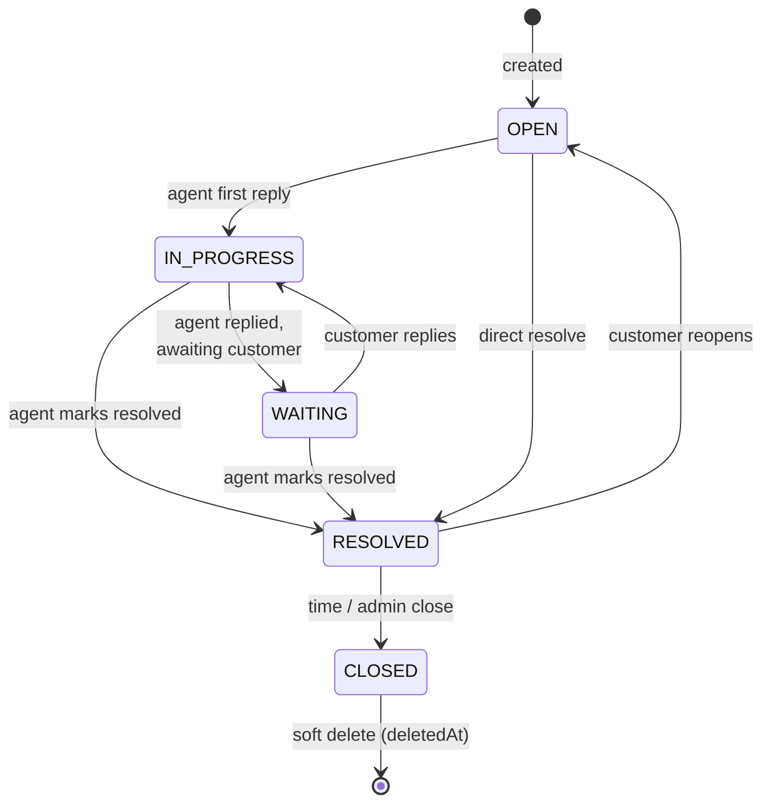
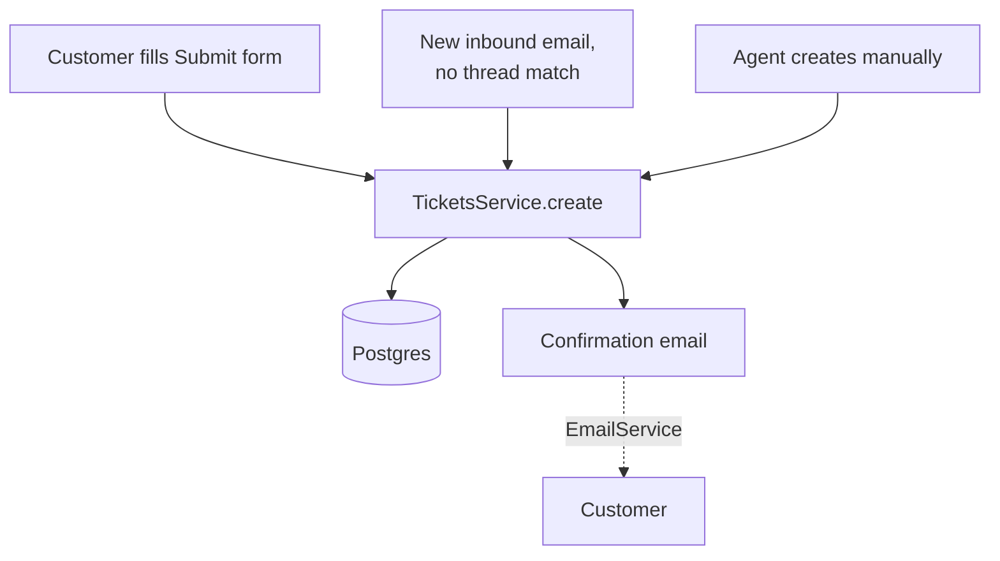

# Tickets

## What it does

The central object of the platform. A ticket represents one customer support conversation — created from the portal form, from an inbound email, or (occasionally) directly by an agent. It carries status, priority, category, optional assigned agent, and a thread of `Message` rows.

## Stack

| Layer | Library / service | Why |
|---|---|---|
| HTTP | NestJS controller + Zod validation | Same pattern as the rest of the API |
| Persistence | Prisma + Postgres | Single source of truth |
| Statuses | Enum in `schema.prisma` | `OPEN · IN_PROGRESS · WAITING · RESOLVED · CLOSED` |
| Soft-delete | `deletedAt` timestamp | Archive instead of hard-delete |
| Ticket number | `@default(autoincrement())` | Human-readable `TMR-1234` displayed in UI + email subjects |

## Lifecycle

Auto-status transitions are wired in [`MessagesService.create`](../../apps/api/src/modules/messages/messages.service.ts) — see the messages atlas for the exact rules.

## Creation paths

`TicketsService.create()` is the single funnel — invoked from the controller for portal submissions, from `InboundEmailProcessor` for fresh email conversations, and from any future channel.

## List + filter + search

The Inbox and All Tickets views use the same `GET /tickets` endpoint with query params:

- `status` — single value or comma-separated list
- `category` — same
- `assigneeId` — `me` resolves to caller; literal id otherwise
- `search` — case-insensitive against title, customer email/name, connector
- `limit` / `offset` — pagination (cursor-based not used; counts are small)
- `sortOrder` — `desc` / `asc` on `createdAt`

Stats endpoint (`GET /tickets/stats`) feeds the sidebar counts and the analytics page; computed via parallel Prisma `groupBy` + `count`.

## Key files

| File | Role |
|---|---|
| [`apps/api/src/modules/tickets/tickets.controller.ts`](../../apps/api/src/modules/tickets/tickets.controller.ts) | HTTP surface |
| [`apps/api/src/modules/tickets/tickets.service.ts`](../../apps/api/src/modules/tickets/tickets.service.ts) | Create / list / search / stats / status transitions / soft-delete |
| [`apps/api/src/modules/tickets/tickets.dto.ts`](../../apps/api/src/modules/tickets/tickets.dto.ts) | Zod schemas for create / update / list |
| [`apps/portal/src/app/submit/page.tsx`](../../apps/portal/src/app/submit/page.tsx) | Customer Submit form |
| [`apps/bridge/src/app/inbox/page.tsx`](../../apps/bridge/src/app/inbox/page.tsx) | Agent Inbox (filtered to active statuses) |
| [`apps/bridge/src/app/tickets/page.tsx`](../../apps/bridge/src/app/tickets/page.tsx) | All Tickets view (any status) |
| [`apps/bridge/src/app/tickets/[id]/page.tsx`](../../apps/bridge/src/app/tickets/[id]/page.tsx) | Ticket detail (thread + reply composer + sidebar) |

## Endpoints

See `TicketsController` in [_generated/api-routes.md](_generated/api-routes.md#ticketscontroller).

## Data model touched

`Ticket` (the row itself), `Message` (thread), `Attachment` (linked at create-time), `User` (customer), `Agent` (assignee), `Notification` (fix-deployed flag). See [_generated/erd.md](_generated/erd.md).

Key enums: `TicketStatus` · `TicketPriority` · `TicketCategory` · `TicketSource`.

## Notable decisions

- **Single-tenant** — `orgId` was removed early. Ticket numbers use a single global sequence.
- **`Attachment.ticketId` is optional** — files are uploaded *before* the ticket exists, then linked at create-time. See [files.md](files.md).
- **Status transitions are inferred from messages**, not set explicitly by agents — see [messages.md](messages.md) for the rules. Agents *can* set status manually too via `PATCH /tickets/:id`.
- **Soft delete only** — archive sets `deletedAt`. The UI filters them out; admins could surface them.

## Known gaps

- No SLA tracking / breach alerts (Phase 2).
- No tags surfaced in the UI beyond the existing `Tag` model.
- No customer-facing "ticket closed" notification — they just see status change in the portal.
